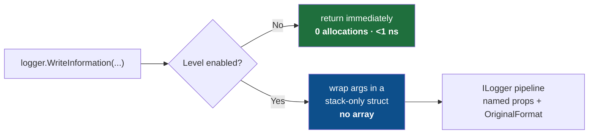

<div align="center">

# ⚡ Nilog

### Zero-allocation, high-performance logging for `Microsoft.Extensions.Logging`

**Same `ILogger`. Same `{Named}` templates. None of the garbage.**

[](https://www.nuget.org/packages/Nilog)
[](https://www.nuget.org/packages/Nilog)
[](LICENSE)
[](https://dotnet.microsoft.com)
[](https://learn.microsoft.com/dotnet/csharp/)
[](#-build-test-benchmark)
[](#-benchmarks)
[](#-thread-safety-and-lifecycle)
[](#-contributing)

</div>

<div align="center">
<samp>

[**Why?**](#-why-nilog) · [**vs Others**](#-nilog-vs-the-alternatives) · [**Benchmarks**](#-benchmarks) · [**Install**](#-install) · [**Quick start**](#-quick-start) · [**Pick a method**](#-choosing-the-right-method) · [**Features**](#-features) · [**Structured**](#-structured-logging-end-to-end) · [**Config**](#-global-configuration) · [**Recipes**](#-recipes) · [**Best practices**](#-best-practices) · [**Migrate**](#-migrating-to-nilog) · [**API**](#-api-reference) · [**How**](#-how-it-works) · [**FAQ**](#-faq)

</samp>
</div>

---

> The stock `ILogger` extensions allocate a **`params object[]` on every single call** — even
> when the level is switched off and the message is thrown straight in the bin. On a hot path
> that is millions of pointless allocations and a busy garbage collector.
>
> **Nilog swaps that array for a stack-only struct.** A disabled call now allocates **nothing**
> and returns in about a **nanosecond**.

```csharp
using Nilog;

logger.WriteInformation("User {UserId} ordered {Count} items", userId, count);
//      ^ no object[] allocated, ever — and nothing at all when Information is disabled
```

### ❌ Before / ✅ After

<table>
<tr>
<th>❌ Plain <code>Microsoft.Extensions.Logging</code></th>
<th>✅ Nilog</th>
</tr>
<tr>
<td>

```csharp
// Allocates an object[] + boxes the ints
// on EVERY call — even if Debug is off.
logger.LogDebug(
    "User {Id} did {Action}",
    id, action);
```

</td>
<td>

```csharp
// Stack-only struct. Zero allocation when
// disabled, ~30% less when enabled.
logger.WriteDebug(
    "User {Id} did {Action}",
    id, action);
```

</td>
</tr>
</table>

---

## ⚡ Why Nilog?

|  |  |
|--|--|
| 🚀 **Zero-alloc disabled path** | A filtered-out call returns in **under a nanosecond** and allocates **0 bytes**. |
| 🧠 **Lean enabled path** | Strongly-typed structs render **~20–40% faster** and use **~30% less** memory than `params`. |
| 🔌 **Drop-in** | Same `ILogger`, same `{Named}` templates, same structured output to Serilog / OTel / Seq / App Insights. |
| 🧩 **Zero setup** | Just `using Nilog;` — no DI, no registration, no config files. |
| 🧯 **Never throws** | A bad template falls back to raw text instead of throwing a `FormatException` out of a log call. |
| 🧵 **Thread-safe & AOT-ready** | Immutable static state, no reflection. Safe under contention, friendly to trimming and Native AOT. |
| 🎯 **Modern & multi-target** | Ships for **.NET 8 · 9 · 10** as a single `Nilog.dll`, with XML docs and SourceLink. |

---

## 🆚 Nilog vs the alternatives

Nilog is **not** a logging framework — it is a thin, zero-allocation front door to the one you
already use. The table below compares the *call-site cost* of writing a log line.

**How to read it:** every row is written so that **✅ is always the good result.**
✅ = yes / good · ❌ = no / not great · ➖ = partial.

| Question | Microsoft `ILogger` | Serilog | **Nilog** |
|----------|:---:|:---:|:---:|
| Plugs into your existing `ILogger` & DI? | ✅ | ➖ <sup>1</sup> | ✅ |
| Supports `{Named}` templates + structured properties? | ✅ | ✅ | ✅ |
| **Avoids the `object[]` allocation per call (1–3 args)?** | ❌ | ❌ | ✅ |
| **Allocates _nothing_ when the level is disabled?** | ❌ | ❌ | ✅ |
| Gets `LoggerMessage` speed with no boilerplate? | ❌ | ❌ | ✅ |
| Has a built-in formatted exception report? | ➖ <sup>2</sup> | ➖ <sup>2</sup> | ✅ |
| Offers a zero-allocation single-key scope? | ❌ | ❌ | ✅ |
| Needs zero setup (just `using Nilog;`)? | ✅ | ❌ <sup>3</sup> | ✅ |

<sub>
<sup>1</sup> Serilog runs its own pipeline; it can sit behind <code>ILogger</code> as a provider.
<sup>2</sup> Both log exceptions, just not Nilog's aligned multi-field report.
<sup>3</sup> Serilog needs sink/configuration before first use.
</sub>

> [!NOTE]
> The ✅/❌ marks describe **design behaviour**, not a head-to-head benchmark of other libraries.
> The hard numbers in [Benchmarks](#-benchmarks) are measured directly against the Microsoft extensions.

### In plain words

- **Avoids the `object[]` allocation** → with Microsoft/Serilog, every `logger.Log…("…{X}…", x)`
  call quietly builds a throwaway array to hold your arguments. Nilog's typed overloads don't —
  so there is **less garbage for the GC** on every line.
- **Allocates nothing when disabled** → if `Debug`/`Trace` is switched off, Microsoft/Serilog
  still build that array *before* discarding the message. Nilog checks first and builds nothing —
  a disabled call is **under a nanosecond and 0 bytes**.

---

## 📊 Benchmarks

> Measured with [BenchmarkDotNet](https://benchmarkdotnet.org) v0.15.8 on **.NET 8.0.27**,
> AMD Ryzen AI 9 365, Windows 11. Reproduce locally with
> `dotnet run -c Release --project Nilog.Benchmark -f net8.0`.

### 🏆 The headline: a disabled log call

This is the call your service makes thousands of times a second when `Debug`/`Trace` is off in production.

```text
Time per call — lower is better (nanoseconds)
Microsoft  ████████████████████████████████████████████████  142.48 ns
Nilog      ▏                                                    0.48 ns   ← ~297× faster

Allocations per call — lower is better (bytes)
Microsoft  ████████████████████████████████████████████████  208 B
Nilog                                                           0 B     ← nothing
```

| Method | Mean | Allocated |
|--------|-----:|----------:|
| Microsoft `.LogInformation` | 142.48 ns | 208 B |
| **Nilog `.WriteInformation`** | **0.48 ns** | **0 B** 🟢 |

**≈297× faster, zero bytes.** The strongly-typed overload is picked at compile time, so there is
no array to build and no value to box before the `IsEnabled` check returns `false`.

### 🔥 Enabled calls (level on, message rendered)

| Scenario | Library | Mean | Allocated |
|----------|---------|-----:|----------:|
| 1 argument  | Microsoft | 72.03 ns | 112 B |
| 1 argument  | **Nilog** | **56.31 ns** `0.78×` | **80 B** `0.71×` |
| 3 arguments | Microsoft | 120.65 ns | 152 B |
| 3 arguments | **Nilog** | **72.16 ns** `0.60×` | **104 B** `0.68×` |

### 📉 Allocation at a glance

```text
Bytes allocated per call  (lower is better)        ░ Microsoft   █ Nilog

disabled   ░░░░░░░░░░░░░░░░░░░░░░░░░░░░░░░░░░░░░░░░░░  208 B
           (nothing)                                    0 B   ✅

1 arg      ░░░░░░░░░░░░░░░░░░░░░░  112 B
           ███████████████  80 B

3 args     ░░░░░░░░░░░░░░░░░░░░░░░░░░░░░  152 B
           ████████████████████  104 B
```

### 🧵 Throughput & contention

| Benchmark | Microsoft | Nilog | Result |
|-----------|----------:|------:|:------:|
| 100,000 sequential logs | 9.71 ms · 15.22 MB | **7.02 ms · 11.41 MB** | **1.38× faster · 25% less RAM** |
| 50,000 logs across all cores | 1.60 ms · 5.35 MB | **1.52 ms · 3.82 MB** | **29% less RAM** |

### 🧰 Scopes & exceptions

| Operation | Mean | Allocated |
|-----------|-----:|----------:|
| `WriteScope("RequestId", value)` — single pair | 11.40 ns | 24 B <sup>†</sup> |
| `WriteScope(dictionary)` — 3 entries | 62.80 ns | 152 B |
| `WriteError(msg, ex, arg)` | 49.47 ns | 72 B |
| `WriteErrorException(ex)` — summary | 176.6 ns | 992 B |
| `WriteErrorException(ex, more: true)` — full report | 4.20 µs | 8.13 KB |

<sub><sup>†</sup> The scope object itself is allocation-free; the 24 B is just boxing the value-type value (`int` here). A reference-type value adds nothing.</sub>

<details>
<summary><b>📐 Benchmark methodology</b></summary>

<br>

- All suites use a `BenchLogger` that **calls the formatter and consumes the result**, so the
  measured cost is real formatting/boxing work — not a no-op sink.
- `[MemoryDiagnoser]` reports managed allocations per operation.
- Disabled-path numbers use a logger whose `IsEnabled` returns `false`; the call site difference
  (array + boxing vs nothing) is exactly what you see.
- Default BenchmarkDotNet job (multiple warmup + measurement iterations). The allocation results
  are unambiguous (**0 B** on the disabled path); absolute timings vary by machine and runtime.
- Reproduce: `dotnet run -c Release --project Nilog.Benchmark -f net8.0`
  (one suite: `-- --filter *DisabledBenchmarks*`; quicker: `-- --job short`).

</details>

---

## 📦 Install

```bash
dotnet add package Nilog
```

```xml
<PackageReference Include="Nilog" Version="1.0.0" />
```

### Compatibility

| | |
|--|--|
| **Runtimes** | .NET 8.0, .NET 9.0, .NET 10.0 |
| **Language** | C# (latest) |
| **Depends on** | `Microsoft.Extensions.Logging.Abstractions`, `Microsoft.Extensions.ObjectPool` |
| **Works with any sink** | Console, Debug, Serilog, NLog, OpenTelemetry, Seq, Application Insights, … |
| **Native AOT / trimming** | ✅ supported (no reflection) |
| **Thread-safe** | ✅ all members |

---

## 🚀 Quick start

```csharp
using Microsoft.Extensions.Logging;
using Nilog; // <- that's the whole setup

ILogger logger = LoggerFactory
    .Create(b => b.AddConsole())
    .CreateLogger("App");

// Plain message
logger.WriteInformation("Service started");

// Structured, strongly-typed, zero array allocation
logger.WriteInformation("User {UserId} signed in from {Ip}", 42, "10.0.0.1");

// An exception with context
try { Risky(); }
catch (Exception ex)
{
    logger.WriteError("Checkout failed for cart {CartId}", ex, cartId);
}
```

Everything still flows through the standard pipeline, so structured properties (`UserId`, `Ip`, …)
and the original template reach Serilog, OpenTelemetry, Seq, Application Insights, or any other
sink exactly as they normally would.

---

## 🧭 Choosing the right method

A quick map from "what I want to log" to "what to call":

| I want to… | Call | Allocates? |
|------------|------|:----------:|
| Log a constant message | `logger.WriteInformation("Started")` | none |
| Log 1–3 structured values | `logger.WriteInformation("User {Id}", id)` | **none** (typed) |
| Log 4+ structured values | `logger.WriteInformation("{A} {B} {C} {D}", …)` | one `object[]` |
| Log an error **with** an exception | `logger.WriteError("Failed {Id}", ex, id)` | **none** (typed) |
| Log an error **without** an exception | `logger.WriteError("Bad request")` | none (no args) |
| Produce a full exception report | `logger.WriteErrorException(ex, "Title", more: true)` | report buffer only |
| Decide the level at runtime | `Nilogger.Log(logger, level, "…", a, b)` | **none** for 1–3 typed |
| Attach context to a block | `using (logger.WriteScope("Key", value)) { … }` | only the boxed value (~24 B) |

> [!TIP]
> Keep templates to **≤ 3 named holes** to stay on the zero-array typed path. For error/critical,
> **pass the exception** to get the typed (zero-array) overload.

---

## ✨ Features

### 🎚️ Six levels, two styles

```csharp
logger.WriteTrace("...");
logger.WriteDebug("...");
logger.WriteInformation("...");
logger.WriteWarning("...");
logger.WriteError("...");
logger.WriteCritical("...");
```

When the level is decided at runtime, use the static API:

```csharp
LogLevel level = isVerbose ? LogLevel.Debug : LogLevel.Information;
Nilogger.Log(logger, level, "Processing {Job}", jobId);
```

### 🧱 Structured logging without the allocation

One to three arguments bind to **strongly-typed** overloads — no `object[]`, and nothing at all
when the level is off:

```csharp
logger.WriteInformation("Order {Id} total {Amount:C}", orderId, amount);
```

Four or more arguments transparently fall back to the familiar `params` form:

```csharp
logger.WriteInformation("Grid {A} {B} {C} {D}", a, b, c, d);
```

Standard template niceties all work — escaping and alignment/format specifiers included:

```csharp
logger.WriteInformation("Progress {Percent,3}% of {{total}}", 7);   // "Progress   7% of {total}"
logger.WriteInformation("Id {Id:000}", 42);                          // "Id 042"
```

<details>
<summary><b>🧯 Rich exception reports</b></summary>

<br>

```csharp
catch (Exception ex)
{
    // One-line summary at Error
    logger.WriteErrorException(ex, title: "Payment failed");

    // Or the full report: stack trace + a walk of inner / aggregate exceptions
    logger.WriteErrorException(ex, title: "Payment failed", moreDetailsEnabled: true);
}
```

The built-in formatter produces an aligned, readable block:

```text
Timestamp      : 2026-06-13T19:33:41.5116876Z
Title          : Payment failed
Exception Type : System.InvalidOperationException
Message        : Could not load user profile
HResult        : -2146233079
Source         : MyApp.Billing
Target Site    : LoadProfile

Stack Trace    :
   at MyApp.Billing.LoadProfile() ...

---- Inner Exceptions ----
> Exception Type : System.Collections.Generic.KeyNotFoundException
> Message        : profile 'alice' not found in cache
```

> [!NOTE]
> **Seeing the report squashed onto one line in the console?** That's the console formatter,
> not Nilog — Nilog always emits the full multi-line text. Microsoft's `SimpleConsole` replaces
> every newline with a space when `SingleLine = true`. Use `o.SingleLine = false` (the default)
> to keep the layout above. File sinks, Azure (App Insights / Log Analytics), Seq, and JSON/
> structured sinks all preserve the line breaks regardless.
>
> ```csharp
> builder.AddSimpleConsole(o => o.SingleLine = false); // keep multi-line reports
> ```

Don't like the format? Swap it out globally (set it back to `null` to restore the default):

```csharp
Nilogger.ExceptionFormatter = (ex, title, verbose) =>
    JsonSerializer.Serialize(new { title, type = ex.GetType().Name, ex.Message });
```

</details>

<details>
<summary><b>🏷️ Scopes, the easy way</b></summary>

<br>

```csharp
using (logger.WriteScope("RequestId", requestId))
{
    logger.WriteInformation("Handling request");   // carries RequestId

    using (logger.WriteScope(new Dictionary<string, object>
    {
        ["UserId"] = userId,
        ["Tenant"] = tenant,
    }))
    {
        logger.WriteWarning("Quota at {Percent}%", 90);  // carries RequestId + UserId + Tenant
    }
}
```

Small contexts (≤ 4 entries) take an allocation-light path; the scope object itself is
**allocation-free** (a single key/value pair only costs the unavoidable boxing of a value-type
value — ~24 B, or nothing for a reference type). Values are copied, so mutating your dictionary
afterwards never corrupts a scope.

</details>

<details>
<summary><b>🔌 Forward-looking async hooks</b></summary>

<br>

```csharp
Nilogger.UseAsyncSinkProvider((level, message, ex) => level >= LogLevel.Information);
await Nilogger.FlushAsync();   // no-op today; keeps your shutdown code correct tomorrow
```

</details>

---

## 🧩 Structured logging, end to end

A single call carries three things to your sink — the **rendered message**, the **named
properties**, and the **original template** (`{OriginalFormat}`) — with no array in sight:

```csharp
logger.WriteInformation("User {UserId} bought {Sku} x{Qty}", 42, "A-100", 3);
```

| What the sink receives | Value |
|------------------------|-------|
| Rendered message | `User 42 bought A-100 x3` |
| `UserId` | `42` |
| `Sku` | `"A-100"` |
| `Qty` | `3` |
| `{OriginalFormat}` | `User {UserId} bought {Sku} x{Qty}` |

That means a JSON/structured sink (Serilog, Seq, OpenTelemetry, Application Insights) gets clean,
queryable fields — exactly as if you had used the framework's own templated logging, just without
the per-call array.

---

## ⚙️ Global configuration

Nilog is configured through a handful of **static, process-wide** settings on `Nilogger`. There
is nothing to register in DI and nothing to construct — set them **once at startup** (for example
at the top of `Program.cs`) and they apply to every `ILogger` in the process.

```csharp
using Microsoft.Extensions.Logging;
using Nilog;

// 1. Customise how exceptions are rendered by WriteErrorException / WriteCriticalException.
//    Assign null at any time to restore the built-in formatter.
Nilogger.ExceptionFormatter = (exception, title, verbose) =>
    $"[{title}] {exception.GetType().Name}: {exception.Message}";

// 2. Decide which entries a custom async/batch sink should keep (default: keep everything).
Nilogger.UseAsyncSinkProvider((level, message, exception) => level >= LogLevel.Information);

// 3. (Optional) Flush buffered async work — handy right before shutdown.
await Nilogger.FlushAsync();

// 4. (Optional) Stop the cached-timestamp timer for deterministic teardown. Nilog already
//    does this automatically on process exit, so it is only needed for short-lived hosts
//    or tests. Safe to call more than once.
Nilogger.ShutdownUtcTimer();
```

| Setting | Default | What it controls |
|---------|---------|------------------|
| `Nilogger.ExceptionFormatter` | built-in aligned report | How `WriteErrorException` / `WriteCriticalException` render an exception. Set to `null` to restore the default. |
| `Nilogger.UseAsyncSinkProvider(filter)` → `Nilogger.AsyncSinkFilter` | keep everything | Predicate consulted by a custom async/batch sink. Passing `null` leaves the current filter unchanged. |
| `Nilogger.FlushAsync(cancellationToken)` | no-op | Awaitable flush hook for buffered sinks. Never throws. |
| `Nilogger.ShutdownUtcTimer()` | auto on process exit | Stops the background timestamp-cache timer. Idempotent. |

> [!NOTE]
> **Log levels and category filters are _not_ a Nilog setting.** Nilog rides on the standard
> `Microsoft.Extensions.Logging` pipeline, so configure minimum levels the usual way — on the
> logging builder or in `appsettings.json` — and Nilog's `IsEnabled` checks honour all of it.

```csharp
// Standard Microsoft.Extensions.Logging setup — Nilog respects every bit of it.
using var loggerFactory = LoggerFactory.Create(builder =>
{
    builder
        .SetMinimumLevel(LogLevel.Information)
        .AddFilter("Microsoft", LogLevel.Warning)
        .AddConsole();
});
```

```jsonc
// ...or via appsettings.json
{
  "Logging": {
    "LogLevel": {
      "Default": "Information",
      "Microsoft": "Warning"
    }
  }
}
```

---

## 🍳 Recipes

### ASP.NET Core (controller / minimal API)

```csharp
using Nilog;

app.MapPost("/orders", (OrderRequest req, ILogger<OrdersController> logger) =>
{
    using (logger.WriteScope("CorrelationId", req.CorrelationId))
    {
        logger.WriteInformation("Creating order for {CustomerId}", req.CustomerId);
        try
        {
            var id = orders.Create(req);
            logger.WriteInformation("Order {OrderId} created", id);
            return Results.Ok(id);
        }
        catch (Exception ex)
        {
            logger.WriteError("Order creation failed for {CustomerId}", ex, req.CustomerId);
            return Results.Problem("Could not create order");
        }
    }
});
```

### Worker / background service hot loop

```csharp
public sealed class IngestWorker(ILogger<IngestWorker> logger) : BackgroundService
{
    protected override async Task ExecuteAsync(CancellationToken stoppingToken)
    {
        while (!stoppingToken.IsCancellationRequested)
        {
            var batch = await queue.DequeueAsync(stoppingToken);

            // Trace is usually OFF in prod — with Nilog this line is <1 ns and 0 bytes.
            logger.WriteTrace("Dequeued {Count} messages", batch.Count);

            foreach (var msg in batch)
            {
                logger.WriteDebug("Processing {MessageId}", msg.Id);
            }
        }
    }
}
```

### Custom JSON exception reports

```csharp
// At startup:
Nilogger.ExceptionFormatter = (ex, title, verbose) => JsonSerializer.Serialize(new
{
    title,
    type = ex.GetType().FullName,
    ex.Message,
    stack = verbose ? ex.StackTrace : null,
});

// Anywhere:
logger.WriteCriticalException(ex, "Database unavailable", moreDetailsEnabled: true);
```

### Works with Serilog as the sink

```csharp
// Serilog is the provider; Nilog is the (zero-alloc) call site.
using var loggerFactory = LoggerFactory.Create(b => b.AddSerilog(
    new LoggerConfiguration().WriteTo.Console().CreateLogger()));

ILogger logger = loggerFactory.CreateLogger("App");
logger.WriteInformation("User {UserId} logged in", 42); // structured props reach Serilog
```

---

## ✅ Best practices

| Do ✅ | Don't ❌ |
|------|---------|
| `logger.WriteInformation("User {Id}", id)` — templated & structured | `logger.WriteInformation($"User {id}")` — interpolation kills structure **and** always allocates |
| Keep to **≤ 3 named holes** for the zero-array path | Pack 6 values into one line and take the `params` array |
| Pass the exception: `WriteError("msg {X}", ex, x)` | `WriteError("msg " + value)` — string concatenation |
| Let the level filter decide; Nilog checks `IsEnabled` for you | Wrap calls in your own `if (logger.IsEnabled(...))` — it's redundant |
| Use `WriteScope` for request/correlation context | Re-log the same ids on every line |
| `using (logger.WriteScope(...))` so the scope disposes | Forget to dispose a scope |

---

## 🔀 Migrating to Nilog

Mostly a find-and-replace. The semantics and templates are identical — only the method name (and,
for errors, the **argument order**) changes.

### From `Microsoft.Extensions.Logging`

| Microsoft | Nilog |
|-----------|-------|
| `logger.LogTrace("t {A}", a)` | `logger.WriteTrace("t {A}", a)` |
| `logger.LogDebug("…")` | `logger.WriteDebug("…")` |
| `logger.LogInformation("…")` | `logger.WriteInformation("…")` |
| `logger.LogWarning("…")` | `logger.WriteWarning("…")` |
| `logger.LogError(ex, "Failed {Id}", id)` | `logger.WriteError("Failed {Id}", ex, id)` ⚠️ exception moves **after** the message |
| `logger.LogCritical(ex, "…")` | `logger.WriteCritical("…", ex)` |
| `logger.BeginScope(state)` | `logger.WriteScope(key, value)` / `logger.WriteScope(dictionary)` |

### From Serilog

| Serilog | Nilog |
|---------|-------|
| `log.Information("User {Id}", id)` | `logger.WriteInformation("User {Id}", id)` |
| `log.Error(ex, "Failed {Id}", id)` | `logger.WriteError("Failed {Id}", ex, id)` |
| `using (LogContext.PushProperty("Key", v))` | `using (logger.WriteScope("Key", v))` |

> [!IMPORTANT]
> Microsoft's `LogError(exception, message, args)` takes the **exception first**; Nilog's
> `WriteError(message, exception, args)` takes the **message first**. Double-check that swap.

---

## 📖 API reference

All members live in namespace `Nilog`. The `Write*` methods are extension methods on `ILogger`;
`Nilogger` also exposes a static API and the global settings.

<details open>
<summary><b>Level methods (Trace / Debug / Information / Warning)</b></summary>

<br>

```csharp
// No-exception levels — typed for 1–3 args, params for the rest.
void WriteTrace      (this ILogger logger, string message, params object[] args);
void WriteTrace<T0>  (this ILogger logger, string message, T0 arg0);
void WriteTrace<T0,T1>     (this ILogger logger, string message, T0 arg0, T1 arg1);
void WriteTrace<T0,T1,T2>  (this ILogger logger, string message, T0 arg0, T1 arg1, T2 arg2);

// Identical shape for WriteDebug, WriteInformation, WriteWarning.
```

</details>

<details>
<summary><b>Error / Critical methods</b></summary>

<br>

```csharp
// Without an exception (params form):
void WriteError    (this ILogger logger, string message, params object[] args);

// With an exception — typed for 1–3 args (zero-array), params for the rest:
void WriteError    (this ILogger logger, string message, Exception exception, params object[] args);
void WriteError<T0>(this ILogger logger, string message, Exception exception, T0 arg0);
void WriteError<T0,T1>    (this ILogger logger, string message, Exception exception, T0 arg0, T1 arg1);
void WriteError<T0,T1,T2> (this ILogger logger, string message, Exception exception, T0 arg0, T1 arg1, T2 arg2);

// Identical shape for WriteCritical.
```

</details>

<details>
<summary><b>Exception reports</b></summary>

<br>

```csharp
void WriteErrorException   (this ILogger logger, Exception ex,
                            string title = "System Error",          bool moreDetailsEnabled = false);
void WriteCriticalException(this ILogger logger, Exception ex,
                            string title = "Critical System Error", bool moreDetailsEnabled = false);
```

</details>

<details>
<summary><b>Scopes</b></summary>

<br>

```csharp
IDisposable WriteScope(this ILogger logger, string key, object value);
IDisposable WriteScope(this ILogger logger, IDictionary<string, object> context);
```

</details>

<details>
<summary><b>Static <code>Nilogger.Log</code> (runtime level)</b></summary>

<br>

```csharp
void Log         (ILogger logger, LogLevel level, string message);
void Log<T1>     (ILogger logger, LogLevel level, string message, T1 arg1);
void Log<T1,T2>  (ILogger logger, LogLevel level, string message, T1 arg1, T2 arg2);
void Log<T1,T2,T3>(ILogger logger, LogLevel level, string message, T1 arg1, T2 arg2, T3 arg3);

void Log(ILogger logger, LogLevel level, string message, Exception exception, params object[] args);
void Log(ILogger logger, LogLevel level, string message, params object[] args);
void Log(ILogger logger, LogLevel level, Exception exception, string messageTemplate, params object[] args);
```

</details>

<details>
<summary><b>Global settings</b></summary>

<br>

```csharp
static Func<Exception, string, bool, string> ExceptionFormatter { get; set; }
static Func<LogLevel, string, Exception, bool> AsyncSinkFilter { get; }

static void UseAsyncSinkProvider(Func<LogLevel, string, Exception, bool> filter);
static Task FlushAsync(CancellationToken cancellationToken = default);
static void ShutdownUtcTimer();
```

</details>

---

## 🔬 How it works



A few deliberate design choices do all the work:

- **Strongly-typed overloads beat `params`.** A call with one to three arguments binds to a
  generic overload in *normal form*, which the C# compiler prefers over the *expanded* params
  form. No array is ever created at the call site.
- **`IsEnabled` is checked first, always.** When a level is off, the method returns before any
  argument is touched — so a disabled call boxes nothing and allocates nothing.
- **Stack-only log state.** Arguments are wrapped in a `readonly struct` that implements
  `IReadOnlyList<KeyValuePair<string, object>>`, so structured sinks still get named properties
  and the `{OriginalFormat}` template — without a heap allocation for the carrier.
- **Cached everything.** Parsed templates, per-level `LoggerMessage` delegates, `EventId`s, and
  a pooled `StringBuilder` are shared process-wide. The UTC timestamp used in exception reports
  is refreshed by a background timer instead of being formatted on every call.
- **Logging never throws.** A template/argument mismatch falls back to the raw template rather
  than letting a `FormatException` escape a log statement.

---

## 🔒 Thread safety and lifecycle

- **Every public member is thread-safe.** The shared state — template cache, pooled
  `StringBuilder`, compiled delegates, cached timestamp — is immutable or concurrency-safe.
- **No reflection.** Nilog is friendly to **trimming** and **Native AOT**.
- **Self-cleaning.** The background timestamp timer is disposed automatically on `ProcessExit`
  and `DomainUnload`. Call `Nilogger.ShutdownUtcTimer()` yourself only for deterministic teardown
  (it is idempotent).
- **Global settings are process-wide.** `ExceptionFormatter` and `AsyncSinkFilter` affect the
  whole process; set them once at startup.

---

## ❓ FAQ

<details>
<summary><b>Does Nilog replace my logging framework?</b></summary>

No. Nilog is a set of extension methods on `ILogger`. Your provider/sink (Console, Serilog, NLog,
OpenTelemetry, Seq, App Insights, …) stays exactly as it is — Nilog just changes the call site.
</details>

<details>
<summary><b>Why <code>Write*</code> and not <code>Log*</code>?</b></summary>

`LogInformation`, `LogError`, etc. are already taken by Microsoft's own `ILogger` extensions.
Re-using those names would cause ambiguous-call compile errors in any file that imports both
namespaces. `Write*` keeps Nilog unambiguous and lets you use both side by side.
</details>

<details>
<summary><b>Is it really zero allocation?</b></summary>

On the **disabled path**, yes — measured at **0 bytes** (and under a nanosecond). On the enabled
path Nilog still allocates the rendered message string (every logger must), but it avoids the
`object[]` and, for 1–3 args, any extra carrier — roughly **30% less** than the framework. A
scope object is allocation-free too; a single value-type value just costs its boxing (~24 B).
</details>

<details>
<summary><b>What about 4+ arguments?</b></summary>

There is no typed overload past three, so the call falls back to the `params object[]` form and
allocates one array — the same as the framework. Prefer ≤ 3 named holes on hot paths.
</details>

<details>
<summary><b>Is it AOT / trimming safe?</b></summary>

Yes. Nilog uses generics, `LoggerMessage`, pooling, and `string.Format` — no reflection — so it
works under trimming and Native AOT.
</details>

<details>
<summary><b>Do structured properties still reach my sink?</b></summary>

Yes. Named holes become structured properties and the original template is preserved as
`{OriginalFormat}`, identical to the framework's templated logging. See
[Structured logging, end to end](#-structured-logging-end-to-end).
</details>

---

## 🛠️ Build, test, benchmark

```bash
# Build everything (net8.0 / net9.0 / net10.0)
dotnet build -c Release

# Run the unit tests (81 tests, all green on net8/9/10)
dotnet test

# See every feature in action
dotnet run -c Release --project Nilog.Demo -f net10.0

# Reproduce the benchmarks above
dotnet run -c Release --project Nilog.Benchmark -f net10.0
#   ...or one suite:  -- --filter *DisabledBenchmarks*
#   ...or faster:     -- --job short
```

**Project layout**

| Project | What it is |
|---------|------------|
| `Nilog.Core` | the library (packs as `Nilog`) |
| `Nilog.Tests` | xUnit suite, 81 tests across net8/9/10 |
| `Nilog.Demo` | runnable, commented feature tour |
| `Nilog.Benchmark` | BenchmarkDotNet suites behind every number above |

---

## 🗺️ Roadmap

- [ ] First-class async/batching sink built on `AsyncSinkFilter` + `FlushAsync`
- [ ] Source-generator overloads beyond three arguments (zero array, any arity)
- [ ] Optional `ActivitySource`/OpenTelemetry correlation helpers

See [CHANGELOG.md](CHANGELOG.md) for released changes.

---

## 🤝 Contributing

Issues and pull requests are welcome. If Nilog saves your hot path some garbage, a ⭐ on the repo
goes a long way.

## 📄 License

**Nilog** built with care by **Gehan Fernando** MIT Licensed

<div align="center"><sub>Built for developers who count their allocations. ⚡</sub></div>
