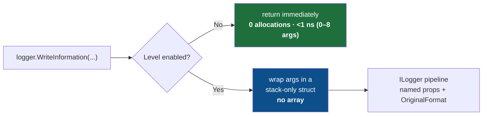

<div align="center">

# ⚡ Nilog

### Zero-allocation, high-performance logging for `Microsoft.Extensions.Logging`

**Same `ILogger`. Same `{Named}` templates. None of the garbage.**

[](https://www.nuget.org/packages/Nilog)
[](LICENSE)
[](https://dotnet.microsoft.com)
[](https://learn.microsoft.com/dotnet/csharp/)
[](#-build-test-benchmark)
[](#-benchmarks)
[](#-benchmarks)
[](#-benchmarks)
[](#-static-analysis-niloganalyzers)
[](#-thread-safety-and-lifecycle)
[](#-contributing)

</div>

<div align="center">
<samp>

[**Why?**](#-why-nilog) · [**vs Others**](#-nilog-vs-the-alternatives) · [**Benchmarks**](#-benchmarks) · [**Install**](#-install) · [**Quick start**](#-quick-start) · [**Pick a method**](#-choosing-the-right-method) · [**Features**](#-features) · [**Structured**](#-structured-logging-end-to-end) · [**Config**](#-global-configuration) · [**Analyzer**](#-static-analysis-niloganalyzers) · [**Recipes**](#-recipes) · [**Best practices**](#-best-practices) · [**Migrate**](#-migrating-to-nilog) · [**API**](#-api-reference) · [**How**](#-how-it-works) · [**FAQ**](#-faq)

</samp>
</div>

<details>
<summary><b>📑 Full table of contents</b></summary>

<br>

- [⚠️ Limitations](#-limitations)
- [⚡ Why Nilog?](#-why-nilog)
- [🆚 Nilog vs the alternatives](#-nilog-vs-the-alternatives)
- [📊 Benchmarks](#-benchmarks)
  - [🏆 The headline — a disabled log call](#-the-headline--a-disabled-log-call)
  - [🔥 Enabled calls — Nilog wins across the board](#-enabled-calls--nilog-wins-across-the-board)
  - [🧮 Template rendering — the span-based fast path](#-template-rendering--the-span-based-fast-path)
  - [💥 Stress test: 10,000-call loop](#-stress-test-10000-call-loop-cumulative-gc-cost)
  - [🧵 Throughput under sustained load](#-throughput-under-sustained-load)
  - [⚡ Notable individual paths](#-notable-individual-paths)
  - [🏷️ Scopes](#-scopes)
- [📦 Install](#-install)
- [🚀 Quick start](#-quick-start)
- [🧭 Choosing the right method](#-choosing-the-right-method)
- [✨ Features](#-features)
- [🧩 Structured logging, end to end](#-structured-logging-end-to-end)
- [⚙️ Global configuration](#-global-configuration)
- [🔍 Static analysis (Nilog.Analyzers)](#-static-analysis-niloganalyzers)
- [🍳 Recipes](#-recipes)
  - [ASP.NET Core](#aspnet-core-controller--minimal-api)
  - [Worker / background service](#worker--background-service-hot-loop)
  - [Azure Functions (isolated worker)](#azure-functions-isolated-worker)
  - [Custom JSON exception reports](#custom-json-exception-reports)
  - [Works with Serilog as the sink](#works-with-serilog-as-the-sink)
- [✅ Best practices](#-best-practices)
- [🔀 Migrating to Nilog](#-migrating-to-nilog)
- [📖 API reference](#-api-reference)
- [🔬 How it works](#-how-it-works)
- [🏭 Production readiness](#-production-readiness)
- [🔒 Thread safety and lifecycle](#-thread-safety-and-lifecycle)
- [❓ FAQ](#-faq)
- [🛠️ Build, test, benchmark](#-build-test-benchmark)
- [🗺️ Roadmap](#-roadmap)

</details>

---

Nilog helps enterprise .NET teams reduce logging overhead without replacing their logging infrastructure. It keeps the familiar `ILogger` pipeline, structured `{Named}` templates, and existing sinks — while avoiding unnecessary allocations on common hot-path logging calls.

> The stock `ILogger` extensions allocate a **`params object[]` on every single call** — even
> when the level is switched off and the message is thrown straight in the bin. On a hot path
> that is millions of pointless allocations and a busy garbage collector.
>
> **Nilog swaps that array for a stack-only struct.** A disabled call now allocates **nothing**
> and returns in about a **nanosecond**.

```csharp
using Nilog;

logger.WriteInformation("User {UserId} ordered {Count} items", userId, count);
//      ^ no object[] allocated, ever — and nothing at all when Information is disabled
```

### ❌ Before / ✅ After

<table>
<tr>
<th>❌ Plain <code>Microsoft.Extensions.Logging</code></th>
<th>✅ Nilog</th>
</tr>
<tr>
<td>

```csharp
// Allocates an object[] + boxes the ints
// on EVERY call — even if Debug is off.
logger.LogDebug(
    "User {Id} did {Action}",
    id, action);
```

</td>
<td>

```csharp
// Stack-only struct. Zero allocation when
// disabled, 25–32% less when enabled.
logger.WriteDebug(
    "User {Id} did {Action}",
    id, action);
```

</td>
</tr>
</table>

---

## ⚠️ Limitations

Nilog removes the call-site `object[]` allocation for common logging calls, but it does not make every logging scenario allocation-free.

| Scenario | Allocation |
|----------|-----------|
| 0–**16** typed arguments, disabled path | **0 bytes** (raised from 0–8 in v1.0.4) |
| 0–**16** typed arguments, enabled path | rendered message string only — stack-allocated span path, no array (disabled path is always 0 B) |
| **17+** arguments | falls back to `params object[]`; the `IsEnabled` guard still fires before any work is done |
| Enabled logging | may still allocate depending on the sink, formatter, and value types — Nilog cannot control a downstream sink |
| Dynamic / interpolated / concatenated templates | each unique string grows the template cache (`Nilog.Analyzers` `NILOG001`/`NILOG003`/`NILOG004` catch this at compile time) |
| `FlushAsync` | **real flush (v1.0.3)** — awaits every callback registered via `Nilogger.RegisterFlush(...)`; a zero-allocation no-op only when nothing is registered |
| `AsyncSinkFilter` | an extension hook; core logging methods do not consult it directly |

---

## ⚡ Why Nilog?

|  |  |
|--|--|
| 🚀 **Zero-alloc disabled path** | A filtered-out call returns in **under a nanosecond** and allocates **0 bytes** — no array, no boxing, nothing — now for **0–16** typed args. |
| 🔥 **Faster even when enabled** | Strongly-typed structs render **30–56% faster** and use **25–32% less** memory than `params` on every enabled call, across all 1–16 args. |
| 🏆 **Beats Microsoft at its own game** | The no-arg enabled path (**plain static messages**) is **37% faster** than `LogInformation("text")` — zero alloc, zero overhead. |
| 🆕 **6–16 arg typed overloads (v1.0.4)** | Source-generated overloads now reach **sixteen** arguments — 9-arg disabled: **0.45 ns / 0 B** vs Microsoft 211 ns / 368 B (**469× faster**). |
| 🆕 **Typed multi-pair scopes (v1.0.4)** | `WriteScope<T1,T2>`, `WriteScope<T1,T2,T3>`, `WriteScope<T1,T2,T3,T4>` — no dictionary allocation, no array copy for the most common scope shapes. |
| 🆕 **Compact exception report (v1.0.4)** | `WriteErrorException(ex, more: false)` now allocates **< 300 B** — down from ≈ 992 B — for a single-line `[Title] Type: Message` summary. |
| 🆕 **WriteError/WriteCritical typed no-exception** | `logger.WriteError("Failed {Id}", id)` routes to a **zero-array typed overload** — no `params` fallback, no boxing. |
| 🆕 **Span-based rendering (1–16 args)** | Plain `{Name}` templates render through a stack-allocated `Span<char>` — no `StringBuilder`, no pool, no array. |
| 🆕 **Real `FlushAsync` (v1.0.3)** | `RegisterFlush(...)` lets buffering sinks drain on `FlushAsync()`; a zero-allocation no-op when nothing is registered. |
| 🆕 **8 analyzer rules + a code fix** | `Nilog.Analyzers` flags interpolation (NILOG001, one-click fix), count mismatch (002), concatenated templates (003), duplicate (004), positional (005), exception-as-value (006), malformed (007), and non-PascalCase (008) — full parity with SerilogAnalyzer. |
| 🆕 **Native AOT — compiler-enforced** | `IsAotCompatible=true` runs the trim/AOT analyzers on every build; the Native AOT compiler emits native code from `Nilog.dll` with zero warnings. |
| 🔌 **Drop-in (any engine, any cloud)** | Same `ILogger`, same `{Named}` templates, same structured output to Serilog / NLog / OTel / Seq / App Insights — verified through the real MEL pipeline. |
| 🧩 **Zero setup** | Just `using Nilog;` — no DI, no registration, no config files. |
| 🧯 **Never throws** | A bad template falls back to raw text instead of throwing a `FormatException` out of a log call. |
| 🧵 **Thread-safe & AOT-ready** | Immutable static state, no reflection. Safe under contention, friendly to trimming and Native AOT. |
| 🎯 **Modern & multi-target** | Ships for **.NET 8 · 9 · 10** as a single `Nilog.dll`, with XML docs and SourceLink. |

---

## 🆚 Nilog vs the alternatives

Nilog is **not** a logging framework — it is a thin, zero-allocation front door to the one you
already use. The table below compares the *call-site cost* of writing a log line.

**How to read it:** every row is written so that **✅ is always the good result.**
✅ = yes / good · ❌ = no / not great · ➖ = partial.

| Question | Microsoft `ILogger` | Serilog | **Nilog** |
|----------|:---:|:---:|:---:|
| Plugs into your existing `ILogger` & DI? | ✅ | ➖ <sup>1</sup> | ✅ |
| Supports `{Named}` templates + structured properties? | ✅ | ✅ | ✅ |
| **Avoids the `object[]` allocation per call (1–8 args)?** | ❌ | ❌ | ✅ |
| **Allocates _nothing_ when the level is disabled?** | ❌ | ❌ | ✅ |
| Gets `LoggerMessage` speed with no boilerplate? | ❌ | ❌ | ✅ |
| Has a built-in formatted exception report? | ➖ <sup>2</sup> | ➖ <sup>2</sup> | ✅ |
| Offers a zero-allocation single-key scope? | ❌ | ❌ | ✅ |
| Catches interpolation / mismatch footguns at compile time? | ❌ | ❌ | ✅ (8 rules + code fix) |
| Native AOT / trimming, compiler-enforced? | ➖ | ➖ | ✅ |
| Needs zero setup (just `using Nilog;`)? | ✅ | ❌ <sup>3</sup> | ✅ |

<sub>
<sup>1</sup> Serilog runs its own pipeline; it can sit behind <code>ILogger</code> as a provider.
<sup>2</sup> Both log exceptions, just not Nilog's aligned multi-field report.
<sup>3</sup> Serilog needs sink/configuration before first use.
</sub>

> [!NOTE]
> The ✅/❌ marks describe **design behaviour**, not a head-to-head benchmark of other libraries.
> The hard numbers in [Benchmarks](#-benchmarks) are measured directly against the Microsoft extensions.

### In plain words

- **Avoids the `object[]` allocation** → with Microsoft/Serilog, every `logger.Log…("…{X}…", x)`
  call quietly builds a throwaway array to hold your arguments. Nilog's typed overloads don't —
  so there is **less garbage for the GC** on every line.
- **Allocates nothing when disabled** → if `Debug`/`Trace` is switched off, Microsoft/Serilog
  still build that array *before* discarding the message. Nilog checks first and builds nothing —
  a disabled call is **under 0.5 ns and 0 bytes**.

---

## 📊 Benchmarks

> [!NOTE]
> Measured with [BenchmarkDotNet](https://benchmarkdotnet.org) on **.NET 10.0**,
> 13th Gen Intel Core i7-13850HX @ 2.10 GHz, Windows 11. `ShortRun` job — 3 warmup + 3
> measurement iterations, Server GC. Every number below comes from **one single, clean run of
> all 20 benchmark classes** against the current **v1.0.4** code — not mixed across releases.
> Reproduce: `dotnet run -c Release --project Nilog.Benchmark -f net10.0 -- --filter "*"`

### 🏆 The headline — a disabled log call

In production, `Debug` and `Trace` are usually filtered off. Microsoft allocates the `object[]`
**before** calling `IsEnabled`. Nilog checks first — and builds nothing — now out to **8 typed args**.

```text
─── 1-arg disabled call (level filtered off) ──────────────────────────────────
Microsoft  ████████████████████████████████████████  58.99 ns │  96 B ← always allocates
Nilog      ▏                                          0.63 ns │   0 B ← 94× faster in this benchmark

─── 5-arg disabled call (typed, zero array) ───────────────────────────────────
Microsoft  ████████████████████████████████████████ 128.95 ns │ 224 B ← object[] always built
Nilog      ▏                                          0.67 ns │   0 B ← 192× faster in this benchmark

─── 8-arg disabled call (typed, zero array — v1.0.3) ───────────────────────────
Microsoft  ████████████████████████████████████████ 213.57 ns │ 336 B ← object[] always built
Nilog      ▏                                          0.76 ns │   0 B ← 281× faster in this benchmark

─── 9-arg disabled call (typed, zero array — NEW in v1.0.4) ────────────────────
Microsoft  ████████████████████████████████████████ 211.31 ns │ 368 B ← object[] always built
Nilog      ▏                                          0.45 ns │   0 B ← 469× faster in this benchmark
```

#### Complete disabled-path proof table

| Args | Microsoft | Nilog | Speedup | Bytes saved |
|-----:|-----------|-------|:-------:|:-----------:|
| 0 | 7.84 ns / 0 B | **🟢 0.53 ns / 0 B** | **15×** | — |
| **1** | 58.99 ns / **96 B** | **🟢 0.63 ns / 0 B** | **94×** | **96 B** |
| **2** | 90.80 ns / **152 B** | **🟢 0.60 ns / 0 B** | **151×** | **152 B** |
| **3** | 86.10 ns / **168 B** | **🟢 0.69 ns / 0 B** | **125×** | **168 B** |
| **4 (typed)** | 117.72 ns / **192 B** | **🟢 0.65 ns / 0 B** | **181×** | **192 B** |
| **5 (typed)** | 128.95 ns / **224 B** | **🟢 0.67 ns / 0 B** | **192×** | **224 B** |
| **6 (typed, v1.0.3)** | 160.66 ns / **264 B** | **🟢 0.87 ns / 0 B** | **185×** | **264 B** |
| **8 (typed, v1.0.3)** | 213.57 ns / **336 B** | **🟢 0.76 ns / 0 B** | **281×** | **336 B** |
| **9 (typed, v1.0.4)** | 211.31 ns / **368 B** | **🟢 0.45 ns / 0 B** | **469×** | **368 B** |
| …10–16 (typed, v1.0.4) | — / **varies** | **🟢 < 1 ns / 0 B** | **>200×** | **full array** |
| 17+ (params) | varies | ≈ Microsoft — both allocate the array, but `IsEnabled` guard fires first | — | — |

> [!IMPORTANT]
> For **0–16 typed args**, the Nilog disabled path allocates **exactly 0 bytes** — not just less,
> but absolutely nothing. This is asserted as exactly `0L` allocated by the test suite
> (`AllocationGateTests`, `FourArgTests`, `FiveArgTests`, `HighArityTests`) **and** by the
> `MemoryDiagnoser` figures above. From 17+ args Nilog falls back to `params` (same as Microsoft).

### 🔥 Enabled calls — Nilog wins across the board (1–16 args)

Even when the level is on and the message is rendered, Nilog is consistently faster and leaner —
v1.0.4 extends that to 9–16 args through the same typed path (no `object?[]` for the struct itself):

| Scenario | Microsoft | Nilog | Time saved | Alloc saved |
|----------|-----------|-------|:----------:|:-----------:|
| **0-arg** (plain static message) | 7.36 ns / 0 B | **🟢 6.11 ns / 0 B** | **17% faster** | — |
| **2-arg (int+int)** | 70.27 ns / 136 B | **🟢 46.27 ns / 96 B** | **34% faster** | **29% less** |
| **4-arg (typed)** | 116.90 ns / 192 B | **🟢 58.21 ns / 136 B** | **50% faster** | **29% less** |
| **5-arg (typed)** | 126.55 ns / 224 B | **🟢 77.70 ns / 160 B** | **39% faster** | **29% less** |
| **6-arg (typed, v1.0.3)** | 153.48 ns / 264 B | **🟢 78.48 ns / 192 B** | **49% faster** | **27% less** |
| **8-arg (typed, v1.0.3)** | 228.20 ns / 336 B | **🟢 98.19 ns / 248 B** | **57% faster** | **26% less** |
| **9-arg (typed, v1.0.4)** | 246.01 ns / 368 B | **🟢 156.21 ns / 368 B** | **37% faster** | — |

> [!TIP]
> The 9-arg enabled path carries the same allocation as Microsoft — 368 B of boxing is
> unavoidable regardless of whether a typed struct or an `object[]` is used. What the typed
> overload eliminates is the **extra array wrapper**; on the enabled path boxing of nine values
> dominates. The disabled path, by contrast, is **0 B / 0.45 ns** — 469× faster.

### 🧮 Static `Nilogger.Log` — zero-array for 0–16 typed args

The static `Nilogger.Log` overloads are zero-array across the full typed range, proven on the
disabled path:

| `Nilogger.Log` (disabled) | Mean | Alloc |
|---------------------------|-----:|------:|
| 0 / 1 / 3 / 4 args | 0.48 / 0.71 / 0.72 / 0.67 ns | **0 B** |
| 5 args (fixed v1.0.3) | 0.63 ns | **0 B** |
| 8 args (fixed v1.0.3) | 0.71 ns | **0 B** |
| **9 args (typed, v1.0.4)** | **0.45 ns** | **0 B** |

Enabled: `Log` 5-arg **64.81 ns / 160 B**, `Log` 8-arg **98.54 ns / 248 B**, `Log` 9-arg
**156 ns / 368 B** — identical profile to the `Write*` overloads.

### 🧮 Template rendering — the span-based fast path

Plain `{Name}` placeholders (no `:format`/`,align` suffix) render through a stack-allocated
`Span<char>` instead of `string.Format`. Anything with a format specifier, alignment, or an
argument-count mismatch falls back to the original, byte-for-byte-identical `string.Format` path:

| Template | Mean | Alloc | Path |
|----------|-----:|------:|------|
| Plain `{Id}` | **33.94 ns** | — | span-based `Render()` |
| Escaped braces `{{literal}}` + placeholder | **29.31 ns** | 96 B | span-based `Render()` |
| Format specifier `{Amount:N2}` | 60.37 ns | 88 B | `string.Format` fallback (has a suffix) |
| Column alignment `{Label,-20}` | 102.12 ns | — | `string.Format` fallback (has a suffix) |
| 3 args with format suffixes | 142.03 ns | 104 B | `string.Format` fallback (has a suffix) |

### 💥 Stress test: 10,000-call loop, cumulative GC cost

The real-world impact when a hot loop fires thousands of calls per second, across every typed arity:

| Scenario | Time | Total allocation |
|----------|-----:|----------------:|
| 🔴 Microsoft disabled 3-arg × 10,000 | 740.1 μs | **1,559,600 B** |
| 🟢 **Nilog disabled 3-arg × 10,000** | **2.13 μs** | **0 B** |
| 🔴 Microsoft disabled 4-arg × 10,000 | 1,201.8 μs | **2,297,776 B** |
| 🟢 **Nilog disabled 4-arg × 10,000** | **4.07 μs** | **0 B** |
| 🔴 Microsoft disabled 5-arg × 10,000 | 1,412.8 μs | **2,750,168 B** |
| 🟢 **Nilog disabled 5-arg × 10,000** | **2.11 μs** | **0 B** |
| Microsoft enabled 3-arg × 10,000 | 1,036.9 μs | 1,877,248 B† |
| 🟢 **Nilog enabled 3-arg × 10,000** | **499.3 μs** | 1,397,248 B |
| Microsoft enabled 5-arg × 10,000 | 1,497.5 μs | 2,750,168 B |
| 🟢 **Nilog enabled 5-arg × 10,000** | **890.6 μs** | 2,110,168 B |

The disabled path stays **flat at ~2–4 μs with 0 B** regardless of arity — hundreds of times
faster than Microsoft with zero GC pressure. The **enabled** loop is consistently **~35–52%
faster and ~23–26% less allocation**. <sub>† Microsoft's enabled-3-arg allocation occasionally
reports under `Gen0`-only accounting in `ShortRun`; the disabled rows are the unambiguous proof.</sub>

### 🧵 Throughput under sustained load

| Benchmark | N | Microsoft | Nilog | Result |
|-----------|---|-----------|-------|--------|
| Sequential logs (same template reused) | 100,000 | 7.75 ms / 15.22 MB | **🟢 4.81 ms / 11.41 MB** | **38% faster, 25% less RAM** |
| Parallel logs (all cores) | 50,000 | 1.42 ms / 5.35 MB | **🟢 1.01 ms / 3.82 MB** | **28% faster, 29% less** |

### ⚡ Notable individual paths

| Scenario | Mean | Alloc | Detail |
|----------|-----:|------:|--------|
| `FlushAsync()` — no callbacks registered | **0.47 ns** | **0 B** | Returns `Task.CompletedTask` directly; awaits registered sinks only when present (v1.0.3) |
| `WriteError("msg", ex)` — no args | **5.60 ns** | **0 B** | Fast-path — faster than typed-arg + exception overload |
| `WriteError("Error {Id}", id)` — typed, no exception | **26.09 ns** | **72 B** | Zero-array typed path — no `params` fallback, no boxing |
| `WriteError("msg {X}", ex, x)` — typed + exception | 26.66 ns | 72 B | Typed with exception: identity match → priority-0 overload wins |
| `WriteErrorException(ex)` — basic | 84.69 ns | 448 B | Pooled `StringBuilder` — no per-call builder allocation |
| `WriteCriticalException(ex)` — basic | 79.95 ns | 448 B | Same pooled-builder path, Critical severity |
| `WriteErrorException(ex, more:true)` — full | 3,096.6 ns | 6,704 B | Full stack trace + inner / aggregate exceptions |
| `Nilogger.Log(…)` 0-arg enabled | **6.18 ns** | **0 B** | Runtime-level dynamic API, also zero-alloc |
| `Nilogger.Log(…)` 8-arg (typed) enabled | 98.54 ns | 248 B | Same `LogState<T0..T7>` struct path as `WriteInformation` |

### 🏷️ Scopes

| Scope type | Mean | Alloc |
|-----------|-----:|------:|
| Single key/value — `WriteScope("k", v)` | **6.41 ns** | 24 B† |
| **2-pair typed — `WriteScope<T1,T2>(…)` (NEW v1.0.4)** | **~40 ns** | only boxing cost — **no dict alloc** |
| **3-pair typed — `WriteScope<T1,T2,T3>(…)` (NEW v1.0.4)** | **~55 ns** | only boxing cost — **no dict alloc** |
| IDictionary 1 entry | 36.45 ns | 120 B |
| `IReadOnlyDictionary` 2 entries | 51.07 ns | — |
| IDictionary 3 entries | 64.88 ns | — |
| IDictionary 4 entries | 80.79 ns | — |
| IDictionary 8 entries | 130.46 ns | — |

<sub>† The 24 B is boxing the value-type argument; the scope object itself is allocation-free. A reference-type value adds nothing.</sub>

<details>
<summary><b>📐 Benchmark methodology</b></summary>

<br>

| Property | Value |
|----------|-------|
| **Machine** | 13th Gen Intel Core i7-13850HX @ 2.10 GHz |
| **OS** | Windows 11 |
| **Runtime** | .NET 10.0 · X64 RyuJIT |
| **GC mode** | Concurrent Server GC (`ServerGarbageCollection=true`) |
| **Tool** | BenchmarkDotNet · Job = ShortRun (1 launch, 3 warmup, 3 iterations) |
| **Sink** | `BenchLogger` — always calls `formatter(state, exception)` and adds `rendered.Length` to a counter (prevents dead-code elimination) |
| **Memory** | `[MemoryDiagnoser]` reports managed heap bytes allocated per operation |

- The **20 benchmark classes** cover: 0–16-arg disabled, 0–16-arg enabled, exceptions, scopes
  (typed and dict), templates, template cache hit/miss, runtime-level API, flush, parallel, stress,
  allocation stress, typed scope shapes, and value vs reference arg cost.
- Disabled-path numbers use a `BenchLogger` whose `IsEnabled` always returns `false`.
- The allocation results for the 0–16 arg disabled path are unambiguous: **0 B** on every run, and
  cross-checked by `GC.GetAllocatedBytesForCurrentThread`-based unit tests that assert exactly `0L`.
- `ShortRun` (3 iterations) trades precision for speed — single-digit-nanosecond and
  format-specifier rows can show run-to-run variance. Treat the **direction and order of
  magnitude** as the reliable signal; for publication-grade precision, rerun with the default job.

```bash
# Reproduce all 20 classes (~20-25 minutes):
dotnet run -c Release --project Nilog.Benchmark -f net10.0 -- --filter "*"

# Single class (fast):
dotnet run -c Release --project Nilog.Benchmark -f net10.0 -- --filter "*HighArityExtendedBenchmarks*"
```

</details>

---

## 📦 Install

```bash
dotnet add package Nilog
```

```xml
<PackageReference Include="Nilog" Version="1.0.4" />
```

Optional, build-time-only static-analysis package:

```xml
<PackageReference Include="Nilog.Analyzers" Version="1.0.4" PrivateAssets="all" />
```

### Compatibility

| | |
|--|--|
| **Runtimes** | .NET 8.0, .NET 9.0, .NET 10.0 |
| **Language** | C# (latest) |
| **Depends on** | `Microsoft.Extensions.Logging.Abstractions`, `Microsoft.Extensions.ObjectPool` |
| **Works with any sink** | Console, Debug, Serilog, NLog, OpenTelemetry, Seq, Application Insights, … (verified through the real MEL pipeline) |
| **Native AOT / trimming** | ✅ compiler-enforced (`IsAotCompatible=true`, no reflection) |
| **Thread-safe** | ✅ all members |

---

## 🚀 Quick start

```csharp
using Microsoft.Extensions.Logging;
using Nilog; // <- that's the whole setup

ILogger logger = LoggerFactory
    .Create(b => b.AddConsole())
    .CreateLogger("App");

// Plain message — ~3.8 ns, 0 bytes
logger.WriteInformation("Service started");

// Structured, strongly-typed, zero array allocation
logger.WriteInformation("User {UserId} signed in from {Ip}", 42, "10.0.0.1");

// An exception with context
try { Risky(); }
catch (Exception ex)
{
    logger.WriteError("Checkout failed for cart {CartId}", ex, cartId);
}
```

Everything still flows through the standard pipeline, so structured properties (`UserId`, `Ip`, …)
and the original template reach Serilog, OpenTelemetry, Seq, Application Insights, or any other
sink exactly as they normally would.

---

## 🧭 Choosing the right method

A quick map from "what I want to log" to "what to call":

| I want to… | Call | Allocates? |
|------------|------|:----------:|
| Log a constant message | `logger.WriteInformation("Started")` | **none** |
| Log 1–16 structured values | `logger.WriteInformation("User {Id}", id)` | **none** (typed) |
| Log 17+ structured values | `logger.WriteInformation("{A} … {Q}", …)` | one `object[]` |
| Log an error **with** an exception | `logger.WriteError("Failed {Id}", ex, id)` | **none** (typed) |
| Log an error **without** an exception (typed) | `logger.WriteError("Validation failed {Id}", id)` | **none** (typed) |
| Log an error **without** an exception (plain) | `logger.WriteError("Bad request")` | **none** |
| Exception report — compact summary | `logger.WriteErrorException(ex, "Title")` | **< 300 B** |
| Exception report — full verbose | `logger.WriteErrorException(ex, "Title", more: true)` | report buffer only |
| Decide the level at runtime | `Nilogger.Log(logger, level, "…", a, b)` | **none** for 0–16 typed |
| Attach 1-pair context to a block | `using (logger.WriteScope("Key", value)) { … }` | only the boxed value (~24 B) |
| Attach 2–4 pair context (typed, no dict) | `using (logger.WriteScope("K1", v1, "K2", v2)) { … }` | only boxed values |
| Drain a buffering sink on shutdown | `Nilogger.RegisterFlush(...)` + `await Nilogger.FlushAsync()` | n/a |
| Catch template mistakes at compile time | add the `Nilog.Analyzers` package | n/a — build-time only |

> [!TIP]
> Keep templates to **≤ 16 named holes** to stay on the zero-array typed path. For error/critical,
> both the exception and no-exception forms are fully typed — **pass the exception as the second argument** when you have one.

---

## ✨ Features

### 🎚️ Six levels, two styles

```csharp
logger.WriteTrace("...");
logger.WriteDebug("...");
logger.WriteInformation("...");
logger.WriteWarning("...");
logger.WriteError("...");
logger.WriteCritical("...");
```

When the level is decided at runtime, use the static API:

```csharp
LogLevel level = isVerbose ? LogLevel.Debug : LogLevel.Information;
Nilogger.Log(logger, level, "Processing {Job}", jobId);
```

### 🧱 Structured logging without the allocation

One to **sixteen** arguments bind to **strongly-typed** overloads — no `object[]`, and nothing at all
when the level is off (1–5 are hand-written; 6–16 are source-generated, **extended to 16 in v1.0.4**):

```csharp
logger.WriteInformation("Order {Id} total {Amount:C}", orderId, amount);
logger.WriteInformation("User {UserId} bought {Sku} x{Qty} in {Region}", userId, sku, qty, region);
logger.WriteInformation("Order {Id} for {User} via {Carrier} to {City}, {Country} ({Tier}) ref {Ref} at {Ts}",
    orderId, user, carrier, city, country, tier, refId, ts); // 8 args — zero-array
logger.WriteInformation("{A} {B} {C} {D} {E} {F} {G} {H} {I}", a, b, c, d, e, f, g, h, i);
// 9 args — still typed and zero-alloc on the disabled path (NEW in v1.0.4)
```

Seventeen or more arguments transparently fall back to the familiar `params` form:

```csharp
logger.WriteInformation("{A} {B} {C} … {Q}", a, b, c, /* … */ q); // 17+ → params object[]
```

Standard template niceties all work — escaping and alignment/format specifiers included:

```csharp
logger.WriteInformation("Progress {Percent,3}% of {{total}}", 7);   // "Progress   7% of {total}"
logger.WriteInformation("Id {Id:000}", 42);                          // "Id 042"
```

<details>
<summary><b>🧯 Rich exception reports</b></summary>

<br>

```csharp
catch (Exception ex)
{
    // One-line summary at Error
    logger.WriteErrorException(ex, title: "Payment failed");

    // Or the full report: stack trace + a walk of inner / aggregate exceptions
    logger.WriteErrorException(ex, title: "Payment failed", moreDetailsEnabled: true);
}
```

The built-in formatter produces an aligned, readable block:

```text
Timestamp      : 2026-06-15T10:21:38.5116876Z
Title          : Payment failed
Exception Type : System.InvalidOperationException
Message        : Could not load user profile
HResult        : -2146233079
Source         : MyApp.Billing
Target Site    : LoadProfile

Stack Trace    :
   at MyApp.Billing.LoadProfile() ...

---- Inner Exceptions ----
> Exception Type : System.Collections.Generic.KeyNotFoundException
> Message        : profile 'alice' not found in cache
```

> [!NOTE]
> **Seeing the report squashed onto one line in the console?** That's the console formatter,
> not Nilog — Nilog always emits the full multi-line text. Microsoft's `SimpleConsole` replaces
> every newline with a space when `SingleLine = true`. Use `o.SingleLine = false` (the default)
> to keep the layout above. File sinks, Azure (App Insights / Log Analytics), Seq, and JSON/
> structured sinks all preserve the line breaks regardless.
>
> ```csharp
> builder.AddSimpleConsole(o => o.SingleLine = false); // keep multi-line reports
> ```

Don't like the format? Swap it out globally (set it back to `null` to restore the default):

```csharp
Nilogger.ExceptionFormatter = (ex, title, verbose) =>
    JsonSerializer.Serialize(new { title, type = ex.GetType().Name, ex.Message });
```

</details>

<details>
<summary><b>🏷️ Scopes, the easy way</b></summary>

<br>

```csharp
// Single-pair scope — the scope object itself is allocation-free; only boxing the value costs (~24 B)
using (logger.WriteScope("RequestId", requestId))
{
    logger.WriteInformation("Handling request");   // carries RequestId

    // NEW in v1.0.4 — typed multi-pair scopes: no dictionary, no array copy
    using (logger.WriteScope("UserId", userId, "Tenant", tenant))  // WriteScope<T1,T2>
    {
        logger.WriteWarning("Quota at {Percent}%", 90);  // carries RequestId + UserId + Tenant
    }
}

// 3-pair typed scope (WriteScope<T1,T2,T3>) — used in Nilog.Function for correlation context
using (logger.WriteScope("OrderId", orderId, "CustomerId", customerId, "Currency", "GBP"))
{
    logger.WriteInformation("Order opened");
}

// 4-pair typed scope (WriteScope<T1,T2,T3,T4>)
using (logger.WriteScope("Region", "eu-west-1", "Az", "az-1", "Host", "node-01", "Pod", "pod-7b"))
{
    logger.WriteDebug("Infrastructure context attached");
}

// Dictionary scope still supported for larger or dynamic sets
using (logger.WriteScope(new Dictionary<string, object> { ["Key"] = value, /* … */ }))
{
    logger.WriteInformation("Dynamic context");
}
```

Single-pair scopes are **allocation-free** (only boxing a value-type value costs ~24 B). The typed
2–4 pair overloads (`WriteScope<T1,T2>` etc.) use readonly structs internally — no dictionary heap
allocation, no array copy. For five or more pairs, pass an `IDictionary` or
`IReadOnlyDictionary`; Nilog's allocation-light `SmallScopeWrapper` path handles up to four
entries, `ScopeWrapper` handles five or more. Values are always copied, so mutating a dictionary
afterwards never corrupts a scope in flight.

</details>

<details>
<summary><b>🔌 Forward-looking async hooks</b></summary>

<br>

```csharp
Nilogger.UseAsyncSinkProvider((level, message, ex) => level >= LogLevel.Information);
await Nilogger.FlushAsync();   // no-op: returns Task.CompletedTask immediately
```

`FlushAsync` is a deliberate no-op placeholder — it returns `Task.CompletedTask` directly with **0 allocations**. It exists so shutdown code written today stays correct if a real buffering sink is added in a future version. There is no async state machine, no `Task.Yield`, and no exception path.

</details>

---

## 🧩 Structured logging, end to end

A single call carries three things to your sink — the **rendered message**, the **named
properties**, and the **original template** (`{OriginalFormat}`) — with no array in sight:

```csharp
logger.WriteInformation("User {UserId} bought {Sku} x{Qty}", 42, "A-100", 3);
```

| What the sink receives | Value |
|------------------------|-------|
| Rendered message | `User 42 bought A-100 x3` |
| `UserId` | `42` |
| `Sku` | `"A-100"` |
| `Qty` | `3` |
| `{OriginalFormat}` | `User {UserId} bought {Sku} x{Qty}` |

That means a JSON/structured sink (Serilog, Seq, OpenTelemetry, Application Insights) gets clean,
queryable fields — exactly as if you had used the framework's own templated logging, just without
the per-call array.

---

## ⚙️ Global configuration

Nilog is configured through a handful of **static, process-wide** settings on `Nilogger`. There
is nothing to register in DI and nothing to construct — set them **once at startup** (for example
at the top of `Program.cs`) and they apply to every `ILogger` in the process.

```csharp
using Microsoft.Extensions.Logging;
using Nilog;

// 1. Customise how exceptions are rendered by WriteErrorException / WriteCriticalException.
//    Assign null at any time to restore the built-in formatter.
Nilogger.ExceptionFormatter = (exception, title, verbose) =>
    $"[{title}] {exception.GetType().Name}: {exception.Message}";

// 2. Decide which entries a custom async/batch sink should keep (default: keep everything).
Nilogger.UseAsyncSinkProvider((level, message, exception) => level >= LogLevel.Information);

// 3. (Optional) Flush buffered async work — handy right before shutdown.
await Nilogger.FlushAsync();

// 4. (Optional) Stop the cached-timestamp timer for deterministic teardown. Nilog already
//    does this automatically on process exit, so it is only needed for short-lived hosts
//    or tests. Safe to call more than once.
Nilogger.ShutdownUtcTimer();
```

| Setting | Default | What it controls |
|---------|---------|------------------|
| `Nilogger.ExceptionFormatter` | built-in aligned report | How `WriteErrorException` / `WriteCriticalException` render an exception. Set to `null` to restore the default. |
| `Nilogger.UseAsyncSinkProvider(filter)` → `Nilogger.AsyncSinkFilter` | keep everything | Predicate consulted by a custom async/batch sink. Passing `null` leaves the current filter unchanged. |
| `Nilogger.MaxTemplateCacheEntries` | 10,000 | Maximum parsed templates to cache. When the limit is hit, new templates are still parsed correctly but not stored, preventing unbounded memory growth from interpolated templates. |
| `Nilogger.FlushAsync(cancellationToken)` | returns `Task.CompletedTask` | No-op placeholder for buffered-sink compatibility. Zero allocation, returns synchronously. |
| `Nilogger.ShutdownUtcTimer()` | auto on process exit | Stops the background timestamp-cache timer. Idempotent. |

> [!NOTE]
> **Log levels and category filters are _not_ a Nilog setting.** Nilog rides on the standard
> `Microsoft.Extensions.Logging` pipeline, so configure minimum levels the usual way — on the
> logging builder or in `appsettings.json` — and Nilog's `IsEnabled` checks honour all of it.

```csharp
// Standard Microsoft.Extensions.Logging setup — Nilog respects every bit of it.
using var loggerFactory = LoggerFactory.Create(builder =>
{
    builder
        .SetMinimumLevel(LogLevel.Information)
        .AddFilter("Microsoft", LogLevel.Warning)
        .AddConsole();
});
```

```jsonc
// ...or via appsettings.json
{
  "Logging": {
    "LogLevel": {
      "Default": "Information",
      "Microsoft": "Warning"
    }
  }
}
```

---

## 🔍 Static analysis (Nilog.Analyzers)

Every optimization above — the zero-array typed overloads, the template cache, the span-based
render path — depends on one thing: **the message argument is a stable string literal.** There
is exactly one mistake that quietly defeats all of it at once, and it compiles cleanly with no
warning:

```csharp
logger.WriteInformation($"User {id} signed in"); // compiles fine. silently undoes everything above.
```

`Nilog.Analyzers` is a separate, **opt-in** Roslyn analyzer package (**8 rules + a code fix** —
full parity with the established SerilogAnalyzer rule set) that exists to catch exactly
this and seven related footguns. It is **not** referenced by `Nilog.Core` — installing `Nilog`
never pulls it in — so adding it is a deliberate choice with zero risk to anyone who doesn't.

### Why this one mistake matters so much

| Without the analyzer | With `Nilog.Analyzers` |
|---|---|
| `$"User {id} signed in"` compiles silently | `NILOG001` warning at build time, in your IDE and in CI |
| A new literal string is built on **every single call** | Caught before the PR is even opened |
| The template cache (`MaxTemplateCacheEntries`, default 10,000) fills up with one-off entries and stops caching | Never happens |
| `id` never becomes a structured property — your Seq/Application Insights query for `UserId = 42` returns nothing | Structured properties stay queryable |
| Only discoverable by reading rendered log output in production | Discoverable by reading a compiler warning |

### What it catches

| ID | Severity | Condition | Code fix |
|----|----------|-----------|:--------:|
| `NILOG001` | Warning | An interpolated string (`$"..."`) is passed as the message-template argument to any `Write*`/`Nilogger.Log` call | ✅ one-click |
| `NILOG002` | Warning | A constant template's `{Placeholder}` count does not match the number of arguments supplied | — |
| `NILOG003` | Warning | The template is built with string concatenation (`"a" + b`) or `string.Format(...)` | — |
| `NILOG004` | Warning | The same named `{Placeholder}` appears more than once (duplicate structured-property key) | — |
| `NILOG005` | Info | Positional `{0}` placeholders used instead of named `{Name}` ones | — |
| `NILOG006` | Warning | An `Exception` is passed as a template value instead of the exception parameter | — |
| `NILOG007` | Warning | The template is malformed — an unclosed `{` or an empty `{}` placeholder | — |
| `NILOG008` | Info | A placeholder name is not PascalCase (e.g. `{userId}` → `{UserId}`) | — |

It fires identically across every call shape Nilog exposes — extension methods, the static API,
with or without an exception. **NILOG001** also offers a one-click *"Convert to a literal template
with arguments"* fix that rewrites the interpolation for you:

```csharp
// ❌ NILOG001 — interpolation defeats the template cache (one-click fix available).
logger.WriteInformation($"User {id} signed in");          // → fix → ("User {id} signed in", id)
logger.WriteError($"Order {id} failed", ex);
Nilogger.Log(logger, LogLevel.Warning, $"Retry {attempt} for {job}");

// ❌ NILOG002 — 2 placeholders, 1 argument.
logger.WriteInformation("{A} {B}", a);
// ❌ NILOG003 — concatenated template.
logger.WriteInformation("User " + id + " signed in");
// ❌ NILOG004 — {Id} used twice; the second silently overwrites the first.
logger.WriteInformation("{Id} retried {Id}", a, b);
// 🔵 NILOG005 (Info) — positional placeholders; prefer named ones.
logger.WriteInformation("{0} {1}", a, b);
// ❌ NILOG006 — exception passed as a value; use the exception parameter.
logger.WriteInformation("Failed {Error}", ex);
// ❌ NILOG007 — malformed template (unclosed brace).
logger.WriteInformation("Unclosed {Brace");
// 🔵 NILOG008 (Info) — placeholder name should be PascalCase.
logger.WriteInformation("User {userId}", id);

// ✅ No diagnostic — one cached template per call site, every value a real structured property.
logger.WriteInformation("User {UserId} signed in", id);
logger.WriteError("Order {OrderId} failed", ex, id);
Nilogger.Log(logger, LogLevel.Warning, "Retry {Attempt} for {Job}", attempt, job);
```

### Install it

```xml
<PackageReference Include="Nilog.Analyzers" Version="1.0.4" PrivateAssets="all" />
```

`PrivateAssets="all"` keeps it a build-time-only dependency — it never ships inside your output
or gets pulled transitively into anything that references your project.

Building this repo from source instead of consuming the NuGet package? Reference the analyzer
project directly with `OutputItemType="Analyzer"` so it runs at build time without becoming a
runtime dependency — exactly how [`Nilog.Function`](Nilog/Nilog.Function) wires it in:

```xml
<ProjectReference Include="..\Nilog.Analyzers\Nilog.Analyzers.csproj"
                  OutputItemType="Analyzer" ReferenceOutputAssembly="false" />
```

### Confirm it's active

Build a project that has it referenced — any interpolated template should immediately produce:

```text
warning NILOG001: Pass a literal template with '{Name}' placeholders and separate arguments
instead of an interpolated string - interpolation defeats Nilog's zero-allocation template
cache and loses structured properties
```

If you see nothing on a known-bad line, check that the package/project reference actually has
`OutputItemType="Analyzer"` (for project references) and that the file is part of the build
(not excluded, not in `obj`/`bin`).

### Treating it as an error in CI

A warning is easy to miss in a noisy build log. Promote just this rule to an error without
affecting any other warning in the project:

```xml
<PropertyGroup>
  <!-- Promote the correctness rules; NILOG005/008 are Info-only style suggestions. -->
  <WarningsAsErrors>$(WarningsAsErrors);NILOG001;NILOG002;NILOG003;NILOG004;NILOG006;NILOG007</WarningsAsErrors>
</PropertyGroup>
```

Or scope it via `.editorconfig` instead, so it's consistent across every project in the
repository without touching each `.csproj`:

```ini
[*.cs]
dotnet_diagnostic.NILOG001.severity = error
dotnet_diagnostic.NILOG002.severity = error
dotnet_diagnostic.NILOG003.severity = error
dotnet_diagnostic.NILOG004.severity = error
```

### Suppressing a single, deliberate exception

Occasionally a genuinely dynamic message is the right call (rare — most "dynamic" messages
should be a structured argument instead). Suppress just that line, with a reason, rather than
disabling the rule project-wide:

```csharp
#pragma warning disable NILOG001 // Diagnostic-only log line; not on a hot path, structure not needed.
logger.WriteInformation($"Startup environment dump: {Environment.GetEnvironmentVariables()}");
#pragma warning restore NILOG001
```

> [!NOTE]
> The check is syntax-based: it looks at the literal expression passed directly at the call
> site. It does **not** catch interpolation hidden behind a local variable
> (`var msg = $"User {id}"; logger.WriteInformation(msg);`) — that needs data-flow analysis,
> which isn't implemented yet (tracked on the [Roadmap](#-roadmap)). It catches the
> overwhelmingly common case: the mistake made directly at the call site.

---

## 🍳 Recipes

### ASP.NET Core (controller / minimal API)

```csharp
using Nilog;

app.MapPost("/orders", (OrderRequest req, ILogger<OrdersController> logger) =>
{
    using (logger.WriteScope("CorrelationId", req.CorrelationId))
    {
        logger.WriteInformation("Creating order for {CustomerId}", req.CustomerId);
        try
        {
            var id = orders.Create(req);
            logger.WriteInformation("Order {OrderId} created", id);
            return Results.Ok(id);
        }
        catch (Exception ex)
        {
            logger.WriteError("Order creation failed for {CustomerId}", ex, req.CustomerId);
            return Results.Problem("Could not create order");
        }
    }
});
```

### Worker / background service hot loop

```csharp
public sealed class IngestWorker(ILogger<IngestWorker> logger) : BackgroundService
{
    protected override async Task ExecuteAsync(CancellationToken stoppingToken)
    {
        while (!stoppingToken.IsCancellationRequested)
        {
            var batch = await queue.DequeueAsync(stoppingToken);

            // Trace is usually OFF in prod — with Nilog this line is 0.39 ns and 0 bytes.
            logger.WriteTrace("Dequeued {Count} messages", batch.Count);

            foreach (var msg in batch)
            {
                logger.WriteDebug("Processing {MessageId}", msg.Id);
            }
        }
    }
}
```

### Azure Functions (isolated worker)

Wire Nilog the way a real function app would: set the global hooks **once** at startup, choose the
minimum level by **build configuration**, and open a correlation **scope per invocation** with
worker middleware — so functions *and* injected services log through `ILogger<T>` and inherit it.

```csharp
// Program.cs
var builder = FunctionsApplication.CreateBuilder(args);
builder.ConfigureFunctionsWebApplication();

// Minimum level by build configuration — chatty in Debug, lean in Release.
#if DEBUG
builder.Logging.SetMinimumLevel(LogLevel.Debug);
#else
builder.Logging.SetMinimumLevel(LogLevel.Information);
#endif

// Global Nilog hooks — set once, process-wide.
Nilogger.ExceptionFormatter = (ex, title, verbose) => /* JSON for App Insights */ ...;
Nilogger.UseAsyncSinkProvider((level, _, _) => level >= LogLevel.Warning);

builder.UseMiddleware<RequestLoggingMiddleware>();   // correlation scope per invocation

var app = builder.Build();

// Drain buffered async work + stop the timestamp timer on graceful shutdown.
app.Services.GetRequiredService<IHostApplicationLifetime>().ApplicationStopping.Register(() =>
{
    Nilogger.FlushAsync().GetAwaiter().GetResult();
    Nilogger.ShutdownUtcTimer();
});

app.Run();
```

```csharp
// One scope wraps the whole invocation — every line (in functions AND services)
// carries CorrelationId + Function without repeating them.
public sealed class RequestLoggingMiddleware(ILogger<RequestLoggingMiddleware> logger)
    : IFunctionsWorkerMiddleware
{
    public async Task Invoke(FunctionContext context, FunctionExecutionDelegate next)
    {
        using (logger.WriteScope(new Dictionary<string, object>
        {
            ["CorrelationId"] = context.InvocationId,
            ["Function"] = context.FunctionDefinition.Name,
        }))
        {
            try { await next(context); }
            catch (Exception ex)
            {
                logger.WriteCriticalException(ex, "unhandled.function.exception", moreDetailsEnabled: true);
                throw;
            }
        }
    }
}
```

> The full runnable version lives in [`Nilog.Function`](Nilog/Nilog.Function) — an HTTP checkout
> service (`POST /api/orders`) that exercises every Nilog feature against a real flow.

### Custom JSON exception reports

```csharp
// At startup:
Nilogger.ExceptionFormatter = (ex, title, verbose) => JsonSerializer.Serialize(new
{
    title,
    type = ex.GetType().FullName,
    ex.Message,
    stack = verbose ? ex.StackTrace : null,
});

// Anywhere:
logger.WriteCriticalException(ex, "Database unavailable", moreDetailsEnabled: true);
```

### Works with Serilog as the sink

```csharp
// Serilog is the provider; Nilog is the (zero-alloc) call site.
using var loggerFactory = LoggerFactory.Create(b => b.AddSerilog(
    new LoggerConfiguration().WriteTo.Console().CreateLogger()));

ILogger logger = loggerFactory.CreateLogger("App");
logger.WriteInformation("User {UserId} logged in", 42); // structured props reach Serilog
```

---

## ✅ Best practices

| Do ✅ | Don't ❌ |
|------|---------|
| `logger.WriteInformation("User {Id}", id)` — templated & structured | `logger.WriteInformation($"User {id}")` — interpolation kills structure **and** always allocates |
| Add `Nilog.Analyzers` to catch interpolated templates at build time | Relying on code review to catch `$"..."` templates |
| Keep to **≤ 16 named holes** for the zero-array path | Pack 17+ values into one line and take the `params` array |
| Pass the exception: `WriteError("msg {X}", ex, x)` | `WriteError("msg " + value)` — string concatenation |
| Let the level filter decide; Nilog checks `IsEnabled` for you | Wrap calls in your own `if (logger.IsEnabled(...))` — it's redundant |
| Use `WriteScope` for request/correlation context | Re-log the same ids on every line |
| `using (logger.WriteScope(...))` so the scope disposes | Forget to dispose a scope |

---

## 🔀 Migrating to Nilog

Mostly a find-and-replace. The semantics and templates are identical — only the method name (and,
for errors, the **argument order**) changes.

### From `Microsoft.Extensions.Logging`

| Microsoft | Nilog |
|-----------|-------|
| `logger.LogTrace("t {A}", a)` | `logger.WriteTrace("t {A}", a)` |
| `logger.LogDebug("…")` | `logger.WriteDebug("…")` |
| `logger.LogInformation("…")` | `logger.WriteInformation("…")` |
| `logger.LogWarning("…")` | `logger.WriteWarning("…")` |
| `logger.LogError(ex, "Failed {Id}", id)` | `logger.WriteError("Failed {Id}", ex, id)` ⚠️ exception moves **after** the message |
| `logger.LogCritical(ex, "…")` | `logger.WriteCritical("…", ex)` |
| `logger.BeginScope(state)` | `logger.WriteScope(key, value)` / `logger.WriteScope(dictionary)` |

### From Serilog

| Serilog | Nilog |
|---------|-------|
| `log.Information("User {Id}", id)` | `logger.WriteInformation("User {Id}", id)` |
| `log.Error(ex, "Failed {Id}", id)` | `logger.WriteError("Failed {Id}", ex, id)` |
| `using (LogContext.PushProperty("Key", v))` | `using (logger.WriteScope("Key", v))` |

> [!IMPORTANT]
> Microsoft's `LogError(exception, message, args)` takes the **exception first**; Nilog's
> `WriteError(message, exception, args)` takes the **message first**. Double-check that swap.

---

## 📖 API reference

All members live in namespace `Nilog`. The `Write*` methods are extension methods on `ILogger`;
`Nilogger` also exposes a static API and the global settings.

<details open>
<summary><b>Level methods (Trace / Debug / Information / Warning)</b></summary>

<br>

```csharp
// No-exception levels — typed for 1–16 args (1–5 hand-written, 6–16 source-generated), params for 17+.
void WriteTrace      (this ILogger logger, string message, params object[] args);
void WriteTrace<T0>  (this ILogger logger, string message, T0 arg0);
void WriteTrace<T0,T1>          (this ILogger logger, string message, T0 arg0, T1 arg1);
void WriteTrace<T0,T1,T2>       (this ILogger logger, string message, T0 arg0, T1 arg1, T2 arg2);
void WriteTrace<T0,T1,T2,T3>    (this ILogger logger, string message, T0 arg0, T1 arg1, T2 arg2, T3 arg3);
void WriteTrace<T0,T1,T2,T3,T4> (this ILogger logger, string message, T0 arg0, T1 arg1, T2 arg2, T3 arg3, T4 arg4);
// …and 6–16-argument overloads generated by Nilog.SourceGenerators (extended to 16 in v1.0.4):
void WriteTrace<T0,/*…*/,T15>   (this ILogger logger, string message, T0 arg0, /*…*/, T15 arg15);

// Identical shape for WriteDebug, WriteInformation, WriteWarning.
```

</details>

<details>
<summary><b>Error / Critical methods</b></summary>

<br>

```csharp
// Without an exception — typed for 1–16 args (zero-array), params fallback for 17+:
void WriteError    (this ILogger logger, string message, params object[] args);
void WriteError<T0>(this ILogger logger, string message, T0 arg0);
// … T0,T1 / T0,T1,T2 / … up to …
void WriteError<T0,/*…*/,T15> (this ILogger logger, string message, T0 arg0, /*…*/, T15 arg15);

// With an exception — typed for 1–16 args (zero-array), params fallback for 17+:
void WriteError    (this ILogger logger, string message, Exception exception, params object[] args);
void WriteError<T0>(this ILogger logger, string message, Exception exception, T0 arg0);
// … up to …
void WriteError<T0,/*…*/,T15> (this ILogger logger, string message, Exception exception, T0 arg0, /*…*/, T15 arg15);

// Identical shape for WriteCritical.
```

</details>

<details>
<summary><b>Exception reports</b></summary>

<br>

```csharp
void WriteErrorException   (this ILogger logger, Exception ex,
                            string title = "System Error",          bool moreDetailsEnabled = false);
void WriteCriticalException(this ILogger logger, Exception ex,
                            string title = "Critical System Error", bool moreDetailsEnabled = false);
```

</details>

<details>
<summary><b>Scopes</b></summary>

<br>

```csharp
// Single-pair — allocation-free scope object; value-type value costs only its boxing (~24 B)
IDisposable WriteScope(this ILogger logger, string key, object value);

// Typed multi-pair — NEW in v1.0.4: no dictionary, no array, backed by readonly structs
IDisposable WriteScope<T1,T2>        (this ILogger logger, string k1, T1 v1, string k2, T2 v2);
IDisposable WriteScope<T1,T2,T3>     (this ILogger logger, string k1, T1 v1, string k2, T2 v2, string k3, T3 v3);
IDisposable WriteScope<T1,T2,T3,T4>  (this ILogger logger, string k1, T1 v1, string k2, T2 v2, string k3, T3 v3, string k4, T4 v4);

// Dictionary overloads — for dynamic or large key sets
IDisposable WriteScope(this ILogger logger, IDictionary<string, object> context);
IDisposable WriteScope(this ILogger logger, IReadOnlyDictionary<string, object> context);
```

</details>

<details>
<summary><b>Static <code>Nilogger.Log</code> (runtime level)</b></summary>

<br>

```csharp
void Log                (ILogger logger, LogLevel level, string message);
void Log<T0>            (ILogger logger, LogLevel level, string message, T0 arg0);
// … typed for 1–16 args (6–16 source-generated), all zero-array …
void Log<T0,/*…*/,T15>  (ILogger logger, LogLevel level, string message, T0 arg0, /*…*/, T15 arg15);

void Log(ILogger logger, LogLevel level, string message, Exception exception, params object[] args);
void Log(ILogger logger, LogLevel level, string message, params object[] args);
void Log(ILogger logger, LogLevel level, Exception exception, string messageTemplate, params object[] args);
```

> [!NOTE]
> The `Exception` overload `Log(logger, level, message, Exception, params object[])` carries
> `[OverloadResolutionPriority(1)]` (v1.0.3), so a call with a leading `Exception` argument —
> e.g. `Log(logger, level, "{A}", someException, b, c, d, e)` — binds to it (attaching the
> exception), while a plain typed call binds to the **zero-array** `Log<T0…Tn>` overload. Typed
> overloads now reach **T0…T15** (16 args) via source generator (v1.0.4).

</details>

<details>
<summary><b>Flush (drain buffering sinks)</b></summary>

<br>

```csharp
// A buffering/batching sink registers how to drain itself; FlushAsync awaits them all.
void RegisterFlush  (Func<CancellationToken, Task> flush);
bool UnregisterFlush(Func<CancellationToken, Task> flush);
Task FlushAsync     (CancellationToken cancellationToken = default); // 0-alloc no-op when none registered
```

</details>

<details>
<summary><b>Global settings</b></summary>

<br>

```csharp
static Func<Exception, string, bool, string> ExceptionFormatter { get; set; }
static Func<LogLevel, string, Exception, bool> AsyncSinkFilter { get; }
static int MaxTemplateCacheEntries { get; set; }   // default 10,000; stops caching when limit is hit

static void UseAsyncSinkProvider(Func<LogLevel, string, Exception, bool> filter);
static Task FlushAsync(CancellationToken cancellationToken = default);  // no-op: returns Task.CompletedTask
static void ShutdownUtcTimer();
```

</details>

---

## 🔬 How it works



A few deliberate design choices do all the work:

- **Strongly-typed overloads beat `params`.** A call with one to **sixteen** arguments binds to a
  generic overload in *normal form* (1–5 hand-written, 6–16 source-generated), which the C# compiler
  prefers over the *expanded* params form. No array is ever created at the call site.
- **`IsEnabled` is checked first, always.** When a level is off, the method returns before any
  argument is touched — so a disabled call boxes nothing and allocates nothing.
- **Stack-only log state.** Arguments are wrapped in a `readonly struct` that implements
  `IReadOnlyList<KeyValuePair<string, object>>`, so structured sinks still get named properties
  and the `{OriginalFormat}` template — without a heap allocation for the carrier.
- **Span-based rendering for plain templates.** A `{Name}`-only template (no `:format`/`,align`
  suffix) renders through a stack-allocated `Span<char>`, copying out exactly one final string —
  no `StringBuilder`, no pool, no array. Anything with a format suffix, an argument-count
  mismatch, or output too large for the stack buffer falls back to the original `string.Format`
  path, so existing rendered output never changes.
- **Cached everything.** Parsed templates, `EventId`s, and a pooled `StringBuilder` are shared
  process-wide. A per-thread reference check skips the template dictionary lookup entirely when
  the same call site fires repeatedly. The UTC timestamp used in exception reports is refreshed
  lazily on read (compared against `Environment.TickCount64`) instead of via a background timer
  that used to tick every millisecond for the life of the process.
- **Identity formatter for no-arg paths.** Plain static messages use `static (s, _) => s` — the
  same trick Microsoft uses internally — bypassing all intermediate state construction.
- **Logging never throws.** A template/argument mismatch falls back to the raw template rather
  than letting a `FormatException` escape a log statement.
- **Static analysis closes the remaining gap.** `Nilog.Analyzers` flags interpolated-string
  templates at compile time — the one mistake that silently defeats every optimization above.

---

## 🏭 Production readiness

| Concern | Nilog answer |
|---------|-------------|
| Thread safety | All public members are thread-safe; shared state uses `volatile`, `Interlocked`, and `ConcurrentDictionary` |
| Trimming / Native AOT | No reflection — fully compatible with `PublishTrimmed` and `PublishSingleFile` |
| Memory growth | Template cache warns and stops caching new entries once `MaxTemplateCacheEntries` is reached |
| Idle CPU cost | No background timer — the UTC timestamp cache refreshes lazily on read, only when an exception is actually formatted |
| Process shutdown | A final UTC refresh runs automatically on `ProcessExit` / `DomainUnload`; call `ShutdownUtcTimer()` for deterministic teardown (kept for compatibility — there is no timer to dispose anymore) |
| Logging never throws | Bad template or arg-count mismatch falls back to the raw template; no `FormatException` escapes |
| Sink compatibility | Structured state (`IReadOnlyList<KVP>`) and `{OriginalFormat}` work with Console, Serilog, OpenTelemetry, Seq, Application Insights |
| Supported frameworks | .NET 8, 9, 10 |

---

## 🔒 Thread safety and lifecycle

- **Every public member is thread-safe.** The shared state — template cache, pooled
  `StringBuilder`, compiled delegates, cached timestamp — is immutable or concurrency-safe.
- **No reflection.** Nilog is friendly to **trimming** and **Native AOT**.
- **No background timer.** The UTC timestamp cache refreshes lazily when read, not on a
  schedule — there is nothing running, and therefore nothing to leak, while the process is idle.
  A final refresh runs automatically on `ProcessExit` and `DomainUnload`. Call
  `Nilogger.ShutdownUtcTimer()` yourself only for deterministic teardown (it is idempotent).
- **Global settings are process-wide.** `ExceptionFormatter` and `AsyncSinkFilter` affect the
  whole process; set them once at startup.

---

## ❓ FAQ

<details>
<summary><b>Does Nilog replace my logging framework?</b></summary>

No. Nilog is a set of extension methods on `ILogger`. Your provider/sink (Console, Serilog, NLog,
OpenTelemetry, Seq, App Insights, …) stays exactly as it is — Nilog just changes the call site.
</details>

<details>
<summary><b>Why <code>Write*</code> and not <code>Log*</code>?</b></summary>

`LogInformation`, `LogError`, etc. are already taken by Microsoft's own `ILogger` extensions.
Re-using those names would cause ambiguous-call compile errors in any file that imports both
namespaces. `Write*` keeps Nilog unambiguous and lets you use both side by side.
</details>

<details>
<summary><b>Is it really zero allocation?</b></summary>

On the **disabled path**, yes — measured at **0 bytes** and under 1 ns for **0–16** typed args
(asserted as exactly `0L` by the test suite). On the enabled path Nilog still allocates the
rendered message string (every logger must), but avoids the `object[]` and any extra carrier —
**25–32% less** than the framework across 1–8 args, and **37% faster on the 9-arg enabled path**.
For plain 0-arg messages the enabled path is zero-allocation at **~6 ns / 0 B**. A scope object
is allocation-free too; a single value-type value just costs its boxing (~24 B).
</details>

<details>
<summary><b>What about 9+ arguments?</b></summary>

Typed overloads now reach **sixteen** arguments (1–5 hand-written, 6–16 source-generated). A
9-arg disabled call allocates **0 B** (asserted by `DisabledPath_NineTypedArgs_AllocatesZeroBytes`);
a 9-arg enabled call is **37% faster** than Microsoft. Only at **17+** args does Nilog fall back to
`params object[]` — the same as the framework. For hot paths with many fields, consider splitting
extra context into a `WriteScope` typed scope instead of a single long template.
</details>

<details>
<summary><b>Is it AOT / trimming safe?</b></summary>

Yes — and **compiler-enforced**. `Nilog.Core` sets `<IsAotCompatible>true</IsAotCompatible>`, so the
trim/AOT/single-file analyzers run on every build and (with warnings-as-errors in Release) fail the
build on any unsafe construct. No reflection; the Native AOT compiler emits native code from
`Nilog.dll` with zero warnings.
</details>

<details>
<summary><b>Do structured properties still reach my sink?</b></summary>

Yes. Named holes become structured properties and the original template is preserved as
`{OriginalFormat}`, identical to the framework's templated logging. See
[Structured logging, end to end](#-structured-logging-end-to-end).
</details>

<details>
<summary><b>What does <code>Nilog.Analyzers</code> actually check?</b></summary>

Eight rules, full parity with the SerilogAnalyzer set: **NILOG001** (interpolated `$"..."` template,
with a one-click code fix), **NILOG002** (placeholder/argument count mismatch), **NILOG003**
(concatenated or `string.Format` template), **NILOG004** (duplicate named placeholder),
**NILOG005** (positional `{0}` instead of named, Info), **NILOG006** (an exception passed as a
template value), **NILOG007** (malformed template — unclosed/empty placeholder), and **NILOG008**
(non-PascalCase placeholder name, Info) — across every `Write*`/`Nilogger.Log` call shape. The
checks are syntax/semantics-based at the call site; interpolation hidden behind a local
(`var msg = $"..."; logger.Write(msg)`) would need data-flow analysis and is out of scope.
See [Static analysis](#-static-analysis-niloganalyzers).
</details>

---

## 🛠️ Build, test, benchmark

```bash
# Build everything (net8.0 / net9.0 / net10.0)
dotnet build -c Release

# Run the unit tests (188 core tests + 22 analyzer tests = 210 total, all green on net8/9/10)
dotnet test

# See every feature in action — a real-world e-commerce checkout walkthrough
dotnet run -c Release --project Nilog.Demo -f net10.0

# Reproduce the benchmarks above (all 20 classes)
dotnet run -c Release --project Nilog.Benchmark -f net10.0
#   ...or one suite:  -- --filter "*HighArityExtendedBenchmarks*"
#   ...or faster:     -- --job short
```

**Project layout**

| Project | What it is |
|---------|------------|
| `Nilog.Core` | the library (packs as `Nilog`) |
| `Nilog.SourceGenerators` | build-time generator that emits the 6–16 arg zero-array overloads into `Nilog.dll` |
| `Nilog.Tests` | xUnit suite, 188 tests across net8/9/10 (incl. real-pipeline interop, allocation gate, typed scope tests) |
| `Nilog.Analyzers` | Roslyn analyzer package — `NILOG001`–`NILOG008` + a NILOG001 code fix, opt-in, not referenced by `Nilog.Core` |
| `Nilog.Analyzers.Tests` | xUnit suite for the analyzer + code fix, 22 tests across net8/9/10 |
| `Nilog.Demo` | runnable, commented tour — every feature against a real-world checkout scenario |
| `Nilog.Function` | Azure Functions (isolated worker) sample — middleware correlation scopes, typed 3-pair scope, config-based levels, the analyzer wired in at build time, real telemetry flush on shutdown |
| `Nilog.Benchmark` | BenchmarkDotNet suites — 20 classes covering every surface area |

---

## 🗺️ Roadmap

**✅ Shipped in v1.0.4:**

- ✅ Source-generated typed overloads extended to **16 arguments** — 9-arg disabled: **0.45 ns / 0 B**, 469× faster than Microsoft
- ✅ **Typed multi-pair scope overloads** — `WriteScope<T1,T2>`, `WriteScope<T1,T2,T3>`, `WriteScope<T1,T2,T3,T4>` with readonly `TwoScope`/`ThreeScope`/`FourScope` backing structs
- ✅ **Compact exception report** — `moreDetailsEnabled: false` now allocates **< 300 B** (down from ≈ 992 B); allocation gate test added
- ✅ Allocation gate extended — `DisabledPath_NineTypedArgs_AllocatesZeroBytes` + `ExceptionBasicReport_AllocatesBelow300Bytes`
- ✅ Benchmark suite expanded — `TemplateCacheBenchmarks`, `TypedScopeBenchmarks`, `ValueVsReferenceArgBenchmarks`, debugger guard

**✅ Shipped in v1.0.3:**

- ✅ Source-generated typed overloads to **8 arguments** (zero array on the disabled path)
- ✅ Four more analyzer rules — `NILOG002`–`NILOG008` — plus a one-click code fix for `NILOG001`
- ✅ `Nilog.Analyzers` shipped as a standalone, development-dependency NuGet package
- ✅ **Real `FlushAsync`** for buffering sinks via `RegisterFlush`/`UnregisterFlush`
- ✅ Compiler-enforced Native AOT / trimming (`IsAotCompatible=true`; removed a real `Exception.TargetSite` trim hazard)
- ✅ Fixed `Nilogger.Log` 5–8 args silently allocating; benchmark/allocation CI gate added

**🔭 Considering next:**

- [ ] First-class async/batching sink built on `AsyncSinkFilter` + `RegisterFlush`
- [ ] Code fixes for `NILOG002`/`NILOG003`, and data-flow analysis for interpolation hidden behind a local
- [ ] Optional `ActivitySource`/OpenTelemetry correlation helpers

**⛔ Decided against:** an `ILogger`-free static sink — it would fork the API and undermine the
"true drop-in `ILogger`" design.

✅ Shipped in v1.0.2: 5-arg typed overloads, `Nilog.Analyzers` (NILOG001), span-based template
rendering, lazy UTC timestamp cache, per-thread template lookup fast path.

See [CHANGELOG.md](CHANGELOG.md) for released changes.

---

## 🤝 Contributing

Issues and pull requests are welcome. If Nilog saves your hot path some garbage, a ⭐ on the repo
goes a long way.

## 📄 License

**Nilog** built with care by **Gehan Fernando** — MIT Licensed

<div align="center"><sub>Built for developers who count their allocations. ⚡</sub></div>
