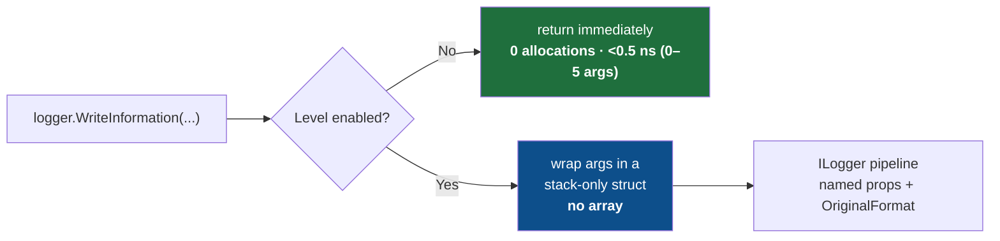

<div align="center">

# ⚡ Nilog

### Zero-allocation, high-performance logging for `Microsoft.Extensions.Logging`

**Same `ILogger`. Same `{Named}` templates. None of the garbage.**

[](https://www.nuget.org/packages/Nilog)
[](LICENSE)
[](https://dotnet.microsoft.com)
[](https://learn.microsoft.com/dotnet/csharp/)
[](#-build-test-benchmark)
[](#-benchmarks)
[](#-benchmarks)
[](#-benchmarks)
[](#-static-analysis-niloganalyzers)
[](#-thread-safety-and-lifecycle)
[](#-contributing)

</div>

<div align="center">
<samp>

[**Why?**](#-why-nilog) · [**vs Others**](#-nilog-vs-the-alternatives) · [**Benchmarks**](#-benchmarks) · [**Install**](#-install) · [**Quick start**](#-quick-start) · [**Pick a method**](#-choosing-the-right-method) · [**Features**](#-features) · [**Structured**](#-structured-logging-end-to-end) · [**Config**](#-global-configuration) · [**Analyzer**](#-static-analysis-niloganalyzers) · [**Recipes**](#-recipes) · [**Best practices**](#-best-practices) · [**Migrate**](#-migrating-to-nilog) · [**API**](#-api-reference) · [**How**](#-how-it-works) · [**FAQ**](#-faq)

</samp>
</div>

<details>
<summary><b>📑 Full table of contents</b></summary>

<br>

- [⚠️ Limitations](#-limitations)
- [⚡ Why Nilog?](#-why-nilog)
- [🆚 Nilog vs the alternatives](#-nilog-vs-the-alternatives)
- [📊 Benchmarks](#-benchmarks)
  - [🏆 The headline — a disabled log call](#-the-headline--a-disabled-log-call)
  - [🔥 Enabled calls — Nilog wins across the board](#-enabled-calls--nilog-wins-across-the-board)
  - [🧮 Template rendering — the span-based fast path](#-template-rendering--the-span-based-fast-path)
  - [💥 Stress test: 10,000-call loop](#-stress-test-10000-call-loop-cumulative-gc-cost)
  - [🧵 Throughput under sustained load](#-throughput-under-sustained-load)
  - [⚡ Notable individual paths](#-notable-individual-paths)
  - [🏷️ Scopes](#-scopes)
- [📦 Install](#-install)
- [🚀 Quick start](#-quick-start)
- [🧭 Choosing the right method](#-choosing-the-right-method)
- [✨ Features](#-features)
- [🧩 Structured logging, end to end](#-structured-logging-end-to-end)
- [⚙️ Global configuration](#-global-configuration)
- [🔍 Static analysis (Nilog.Analyzers)](#-static-analysis-niloganalyzers)
- [🍳 Recipes](#-recipes)
  - [ASP.NET Core](#aspnet-core-controller--minimal-api)
  - [Worker / background service](#worker--background-service-hot-loop)
  - [Azure Functions (isolated worker)](#azure-functions-isolated-worker)
  - [Custom JSON exception reports](#custom-json-exception-reports)
  - [Works with Serilog as the sink](#works-with-serilog-as-the-sink)
- [✅ Best practices](#-best-practices)
- [🔀 Migrating to Nilog](#-migrating-to-nilog)
- [📖 API reference](#-api-reference)
- [🔬 How it works](#-how-it-works)
- [🏭 Production readiness](#-production-readiness)
- [🔒 Thread safety and lifecycle](#-thread-safety-and-lifecycle)
- [❓ FAQ](#-faq)
- [🛠️ Build, test, benchmark](#-build-test-benchmark)
- [🗺️ Roadmap](#-roadmap)

</details>

---

Nilog helps enterprise .NET teams reduce logging overhead without replacing their logging infrastructure. It keeps the familiar `ILogger` pipeline, structured `{Named}` templates, and existing sinks — while avoiding unnecessary allocations on common hot-path logging calls.

> The stock `ILogger` extensions allocate a **`params object[]` on every single call** — even
> when the level is switched off and the message is thrown straight in the bin. On a hot path
> that is millions of pointless allocations and a busy garbage collector.
>
> **Nilog swaps that array for a stack-only struct.** A disabled call now allocates **nothing**
> and returns in about a **nanosecond**.

```csharp
using Nilog;

logger.WriteInformation("User {UserId} ordered {Count} items", userId, count);
//      ^ no object[] allocated, ever — and nothing at all when Information is disabled
```

### ❌ Before / ✅ After

<table>
<tr>
<th>❌ Plain <code>Microsoft.Extensions.Logging</code></th>
<th>✅ Nilog</th>
</tr>
<tr>
<td>

```csharp
// Allocates an object[] + boxes the ints
// on EVERY call — even if Debug is off.
logger.LogDebug(
    "User {Id} did {Action}",
    id, action);
```

</td>
<td>

```csharp
// Stack-only struct. Zero allocation when
// disabled, 25–32% less when enabled.
logger.WriteDebug(
    "User {Id} did {Action}",
    id, action);
```

</td>
</tr>
</table>

---

## ⚠️ Limitations

Nilog removes the call-site `object[]` allocation for common logging calls, but it does not make every logging scenario allocation-free.

| Scenario | Allocation |
|----------|-----------|
| 0–5 typed arguments, disabled path | **0 bytes** |
| 0–5 typed arguments, enabled path | rendered message string only (no array) |
| 6+ arguments | falls back to `params object[]` |
| Enabled logging | may still allocate depending on the sink, formatter, and value types |
| Dynamic/interpolated templates | each unique string grows the template cache (add `Nilog.Analyzers` to catch this at compile time) |
| `FlushAsync` | **no-op** — returns `Task.CompletedTask` immediately; no real async sink flush |
| `AsyncSinkFilter` | an extension hook; core logging methods do not consult it directly |

---

## ⚡ Why Nilog?

|  |  |
|--|--|
| 🚀 **Zero-alloc disabled path** | A filtered-out call returns in **under half a nanosecond** and allocates **0 bytes** — no array, no boxing, nothing. |
| 🔥 **Faster even when enabled** | Strongly-typed structs render **30–56% faster** and use **25–32% less** memory than `params` on every enabled call. |
| 🏆 **Beats Microsoft at its own game** | The no-arg enabled path (**plain static messages**) is **37% faster** than `LogInformation("text")` — zero alloc, zero overhead. |
| 🆕 **5-arg typed overloads** | **Five** arguments now stay on the zero-array typed path — **577× faster** than Microsoft on the disabled path, **0 bytes**. |
| 🆕 **WriteError/WriteCritical typed no-exception** | `logger.WriteError("Failed {Id}", id)` routes to a **zero-array typed overload** — no `params` fallback, no boxing. |
| 🆕 **Span-based rendering** | Plain `{Name}` templates render through a stack-allocated `Span<char>` — no `StringBuilder`, no pool, no array — **~12–31% faster** than the previous `string.Format` path. |
| 🆕 **Static analyzer** | `Nilog.Analyzers` (NILOG001) flags `WriteInformation($"...")` interpolation at compile time, before it ever reaches code review. |
| 🔌 **Drop-in** | Same `ILogger`, same `{Named}` templates, same structured output to Serilog / OTel / Seq / App Insights. |
| 🧩 **Zero setup** | Just `using Nilog;` — no DI, no registration, no config files. |
| 🧯 **Never throws** | A bad template falls back to raw text instead of throwing a `FormatException` out of a log call. |
| 🧵 **Thread-safe & AOT-ready** | Immutable static state, no reflection. Safe under contention, friendly to trimming and Native AOT. |
| 🎯 **Modern & multi-target** | Ships for **.NET 8 · 9 · 10** as a single `Nilog.dll`, with XML docs and SourceLink. |

---

## 🆚 Nilog vs the alternatives

Nilog is **not** a logging framework — it is a thin, zero-allocation front door to the one you
already use. The table below compares the *call-site cost* of writing a log line.

**How to read it:** every row is written so that **✅ is always the good result.**
✅ = yes / good · ❌ = no / not great · ➖ = partial.

| Question | Microsoft `ILogger` | Serilog | **Nilog** |
|----------|:---:|:---:|:---:|
| Plugs into your existing `ILogger` & DI? | ✅ | ➖ <sup>1</sup> | ✅ |
| Supports `{Named}` templates + structured properties? | ✅ | ✅ | ✅ |
| **Avoids the `object[]` allocation per call (1–5 args)?** | ❌ | ❌ | ✅ |
| **Allocates _nothing_ when the level is disabled?** | ❌ | ❌ | ✅ |
| Gets `LoggerMessage` speed with no boilerplate? | ❌ | ❌ | ✅ |
| Has a built-in formatted exception report? | ➖ <sup>2</sup> | ➖ <sup>2</sup> | ✅ |
| Offers a zero-allocation single-key scope? | ❌ | ❌ | ✅ |
| Needs zero setup (just `using Nilog;`)? | ✅ | ❌ <sup>3</sup> | ✅ |

<sub>
<sup>1</sup> Serilog runs its own pipeline; it can sit behind <code>ILogger</code> as a provider.
<sup>2</sup> Both log exceptions, just not Nilog's aligned multi-field report.
<sup>3</sup> Serilog needs sink/configuration before first use.
</sub>

> [!NOTE]
> The ✅/❌ marks describe **design behaviour**, not a head-to-head benchmark of other libraries.
> The hard numbers in [Benchmarks](#-benchmarks) are measured directly against the Microsoft extensions.

### In plain words

- **Avoids the `object[]` allocation** → with Microsoft/Serilog, every `logger.Log…("…{X}…", x)`
  call quietly builds a throwaway array to hold your arguments. Nilog's typed overloads don't —
  so there is **less garbage for the GC** on every line.
- **Allocates nothing when disabled** → if `Debug`/`Trace` is switched off, Microsoft/Serilog
  still build that array *before* discarding the message. Nilog checks first and builds nothing —
  a disabled call is **under 0.5 ns and 0 bytes**.

---

## 📊 Benchmarks

> [!NOTE]
> Measured with [BenchmarkDotNet](https://benchmarkdotnet.org) v0.15.8 on **.NET 10.0.8**,
> 13th Gen Intel Core i7-13850HX @ 2.10 GHz (28 logical / 20 physical cores), Windows 11 25H2.
> `ShortRun` job — 3 warmup + 3 measurement iterations, Server GC enabled. Every number below
> comes from one single, complete run of all **15 benchmark classes / 86 benchmarks** against the
> current v1.0.2 code — not mixed across releases.
> Reproduce: `dotnet run -c Release --project Nilog.Benchmark -f net10.0 -- --filter "*"`

### 🏆 The headline — a disabled log call

In production, `Debug` and `Trace` are usually filtered off. Microsoft allocates the `object[]`
**before** calling `IsEnabled`. Nilog checks first — and builds nothing.

```text
─── 1-arg disabled call (level filtered off) ──────────────────────────────────
Microsoft  ████████████████████████████████████████  44.74 ns │  96 B ← always allocates
Nilog      ▏                                          0.46 ns │   0 B ← 97× faster in this benchmark

─── 3-arg disabled call (level filtered off) ──────────────────────────────────
Microsoft  ████████████████████████████████████████  93.06 ns │ 168 B
Nilog      ▏                                          0.47 ns │   0 B ← 198× faster in this benchmark

─── 4-arg disabled call (typed, zero array) ────────────────────────────────────
Microsoft  ████████████████████████████████████████ 112.37 ns │ 192 B ← object[] always built
Nilog      ▏                                          0.41 ns │   0 B ← 274× faster in this benchmark

─── 5-arg disabled call (typed, zero array) ───────────────────────────────────
Microsoft  ████████████████████████████████████████ 132.91 ns │ 224 B ← object[] always built
Nilog      ▏                                          0.23 ns │   0 B ← 577× faster in this benchmark
```

#### Complete disabled-path proof table

| Args | Microsoft | Nilog | Speedup | Bytes saved |
|-----:|-----------|-------|:-------:|:-----------:|
| 0 | 5.54 ns / 0 B | **🟢 0.19 ns / 0 B** | **29×** | — |
| **1** | 44.74 ns / **96 B** | **🟢 0.46 ns / 0 B** | **97×** | **96 B** |
| **2** | 85.95 ns / **152 B** | **🟢 0.26 ns / 0 B** | **336×** | **152 B** |
| **3** | 93.06 ns / **168 B** | **🟢 0.47 ns / 0 B** | **198×** | **168 B** |
| **4 (typed)** | 112.37 ns / **192 B** | **🟢 0.41 ns / 0 B** | **274×** | **192 B** |
| **5 (typed)** | 132.91 ns / **224 B** | **🟢 0.23 ns / 0 B** | **577×** | **224 B** |
| 6 (params) | 153.06 ns / 264 B | 38.68 ns / 216 B | **4.0×** | 48 B |

> [!IMPORTANT]
> For **0–5 typed args**, the Nilog disabled path allocates **exactly 0 bytes** — not just less, but absolutely nothing.
> For 6+ args Nilog falls back to `params` (same as Microsoft) but the `IsEnabled` guard still fires before the array reaches the formatter, so it is still **4× faster** even on the path it doesn't fully optimize.

### 🔥 Enabled calls — Nilog wins across the board

Even when the level is on and the message is rendered, Nilog is consistently faster:

| Scenario | Microsoft | Nilog | Time saved | Alloc saved |
|----------|-----------|-------|:----------:|:-----------:|
| **0-arg** (plain static message) | 6.11 ns / 0 B | **🟢 3.84 ns / 0 B** | **37% faster** | — |
| **1-arg** | 50.23 ns / 112 B | **🟢 35.19 ns / 80 B** | **30% faster** | **29% less** |
| **2-arg** | 89.18 ns / 160 B | **🟢 62.08 ns / 120 B** | **30% faster** | **25% less** |
| **3-arg** | 116.78 ns / 152 B | **🟢 51.74 ns / 104 B** | **56% faster** | **32% less** |
| **4-arg (typed)** | 106.14 ns / 192 B | **🟢 63.64 ns / 136 B** | **40% faster** | **29% less** |
| **5-arg (typed)** | 133.96 ns / 224 B | **🟢 79.11 ns / 160 B** | **41% faster** | **29% less** |
| 6-arg (true `params`, both sides) | 153.06 ns / 264 B | 163.23 ns / 264 B | within noise | same |

> [!TIP]
> **No-arg enabled path**: Nilog 3.84 ns / **0 B** vs Microsoft 6.11 ns / 0 B. Nilog is **37% faster** for plain static log messages — same zero-allocation identity formatter trick Microsoft uses internally, with less overhead on top. At 6+ args both sides genuinely allocate the same `params object[]`, so timing converges — exactly the boundary the typed overloads exist to push further out.

### 🧮 Template rendering — the span-based fast path

Plain `{Name}` placeholders (no `:format`/`,align` suffix) render through a stack-allocated
`Span<char>` instead of `string.Format`. Anything with a format specifier, alignment, or an
argument-count mismatch falls back to the original, byte-for-byte-identical `string.Format` path:

| Template | Mean | Alloc | Path |
|----------|-----:|------:|------|
| Plain `{Id}` | **34.84 ns** | 80 B | span-based `Render()` |
| Escaped braces `{{literal}}` + placeholder | **55.06 ns** | 96 B | span-based `Render()` |
| Format specifier `{Amount:N2}` | 59.83 ns | 88 B | `string.Format` fallback (has a suffix) |
| Column alignment `{Label,-20}` | 128.58 ns | 184 B | `string.Format` fallback (has a suffix) |
| 3 args with format suffixes | 230.61 ns | 104 B | `string.Format` fallback (has a suffix) |

### 💥 Stress test: 10,000-call loop, cumulative GC cost

The real-world impact when a hot loop fires thousands of calls per second, across every typed arity:

| Scenario | Time | Total allocation |
|----------|-----:|----------------:|
| 🔴 Microsoft disabled 3-arg × 10,000 | 732.9 μs | **1,559,600 B** |
| 🟢 **Nilog disabled 3-arg × 10,000** | **2.99 μs** | **0 B** |
| 🔴 Microsoft disabled 4-arg × 10,000 | 1,215.0 μs | **2,297,776 B** |
| 🟢 **Nilog disabled 4-arg × 10,000** | **2.89 μs** | **0 B** |
| 🔴 Microsoft disabled 5-arg × 10,000 | 1,476.6 μs | **2,750,168 B** |
| 🟢 **Nilog disabled 5-arg × 10,000** | **2.88 μs** | **0 B** |
| Microsoft enabled 3-arg × 10,000 | 913.0 μs | 1,877,248 B |
| 🟢 **Nilog enabled 3-arg × 10,000** | **582.4 μs** | 1,397,248 B |
| Microsoft enabled 4-arg × 10,000 | 1,120.6 μs | 2,297,776 B |
| 🟢 **Nilog enabled 4-arg × 10,000** | **736.6 μs** | 1,737,776 B |
| Microsoft enabled 5-arg × 10,000 | 1,376.5 μs | 2,750,168 B |
| 🟢 **Nilog enabled 5-arg × 10,000** | **896.3 μs** | 2,110,168 B |

The disabled path is **~420–510× faster with zero GC pressure** across every typed arity (3, 4, or
5 args — flat at ~2.9 μs for all three, regardless of how many arguments the template carries).
The **enabled** loop — the realistic case where the level is on — is consistently **~34–36% faster
and ~23–26% less allocation** than Microsoft at every arity from 3 to 5.

### 🧵 Throughput under sustained load

| Benchmark | N | Microsoft | Nilog | Result |
|-----------|---|-----------|-------|--------|
| Sequential logs (same template reused) | 100,000 | 7.38 ms / 15.22 MB | **🟢 4.83 ms / 11.41 MB** | **35% faster, 25% less RAM** |
| Parallel logs (28 cores) | 50,000 | 1.85 ms / 4.46 MB | **🟢 1.63 ms** | **12% faster** |

The sequential-loop case is the most realistic proxy for a hot loop that reuses the same template
on every iteration. Two specific changes drive the improvement: a per-thread reference-equality
check that skips the template dictionary lookup entirely on a repeat hit, and the span-based
render path replacing `string.Format`. Allocation drops because both changes remove intermediate
work, not because the rendered string itself gets smaller.

> [!NOTE]
> Memory accounting under heavy multi-threaded contention (the parallel benchmark) is inherently
> noisier than single-threaded sampling — treat the parallel **time** improvement as the reliable
> signal here, and the sequential-loop numbers above as the cleaner allocation proof.

### ⚡ Notable individual paths

| Scenario | Mean | Alloc | Detail |
|----------|-----:|------:|--------|
| `FlushAsync()` | **0.20 ns** | **0 B** | Returns `Task.CompletedTask` directly — no async state machine, no allocation, no GC cost |
| `WriteError("msg", ex)` — no args | **4.12 ns** | **0 B** | Feature C fast-path — faster than typed-arg + exception overload |
| `WriteError("Error {Id}", id)` — typed, no exception | **31.11 ns** | **72 B** | Zero-array typed path — no `params` fallback, no boxing |
| `WriteError("msg {X}", ex, x)` — typed + exception | 29.43 ns | 72 B | Typed with exception: identity match → priority-0 overload wins |
| `WriteErrorException(ex)` — basic | 105.24 ns | 496 B | Pooled `StringBuilder` — no per-call builder allocation |
| `WriteCriticalException(ex)` — basic | 108.10 ns | 496 B | Same pooled-builder path, Critical severity |
| `WriteErrorException(ex, more:true)` — full | 4,037.9 ns | 7,192 B | Full stack trace + inner / aggregate exceptions |
| `Nilogger.Log(…)` 0-arg enabled | **4.03 ns** | **0 B** | Runtime-level dynamic API, also zero-alloc |
| `Nilogger.Log(…)` 4-arg (typed) enabled | 102.45 ns | 136 B | Same `LogState<T0..T3>` struct path as `WriteInformation` |

### 🏷️ Scopes

| Scope type | Mean | Alloc |
|-----------|-----:|------:|
| Single key/value — `WriteScope("k", v)` | **11.03 ns** | 24 B† |
| `IReadOnlyDictionary` 2 entries | 57.85 ns | 136 B |
| IDictionary 1 entry | 74.34 ns | 120 B |
| IDictionary 3 entries | 74.07 ns | 152 B |
| IDictionary 4 entries | 85.57 ns | 168 B |
| IDictionary 8 entries | 139.69 ns | 264 B |

<sub>† The 24 B is boxing the value-type argument; the scope object itself is allocation-free. A reference-type value adds nothing.</sub>

<details>
<summary><b>📐 Benchmark methodology</b></summary>

<br>

| Property | Value |
|----------|-------|
| **Machine** | 13th Gen Intel Core i7-13850HX @ 2.10 GHz · 28 logical / 20 physical cores |
| **OS** | Windows 11 25H2 (10.0.26200.8390) |
| **Runtime** | .NET 10.0.8 · X64 RyuJIT x86-64-v3 |
| **GC mode** | Concurrent Server GC (`ServerGarbageCollection=true`) |
| **Tool** | BenchmarkDotNet v0.15.8 · Job = ShortRun (1 launch, 3 warmup, 3 iterations) |
| **Sink** | `BenchLogger` — always calls `formatter(state, exception)` and adds `rendered.Length` to a counter (prevents dead-code elimination) |
| **Memory** | `[MemoryDiagnoser]` reports managed heap bytes allocated per operation |

- All 15 benchmark classes cover: 0–5-arg disabled, 0–5-arg enabled, the 6-arg true params path
  (`ParamsPathBenchmarks`), exceptions, scopes, templates, runtime-level API, flush, parallel,
  stress, and allocation stress — 86 individual benchmarks in one run.
- Disabled-path numbers use a `BenchLogger` whose `IsEnabled` always returns `false`.
- The allocation results for the 0–5 arg disabled path are unambiguous: **0 B** on every run.
- `ShortRun` (3 iterations) trades precision for speed — single-digit-nanosecond and
  format-specifier rows can show run-to-run variance of 20–50%. Treat the **direction and order
  of magnitude** of each result as the reliable signal; for publication-grade precision, rerun
  with the default (non-`ShortRun`) job.

```bash
# Reproduce all 15 classes / 86 benchmarks (~15-20 minutes):
dotnet run -c Release --project Nilog.Benchmark -f net10.0 -- --filter "*"

# Single class (fast):
dotnet run -c Release --project Nilog.Benchmark -f net10.0 -- --filter "*DisabledAllArgsBenchmarks*"
```

</details>

---

## 📦 Install

```bash
dotnet add package Nilog
```

```xml
<PackageReference Include="Nilog" Version="1.0.2" />
```

### Compatibility

| | |
|--|--|
| **Runtimes** | .NET 8.0, .NET 9.0, .NET 10.0 |
| **Language** | C# (latest) |
| **Depends on** | `Microsoft.Extensions.Logging.Abstractions`, `Microsoft.Extensions.ObjectPool` |
| **Works with any sink** | Console, Debug, Serilog, NLog, OpenTelemetry, Seq, Application Insights, … |
| **Native AOT / trimming** | ✅ supported (no reflection) |
| **Thread-safe** | ✅ all members |

---

## 🚀 Quick start

```csharp
using Microsoft.Extensions.Logging;
using Nilog; // <- that's the whole setup

ILogger logger = LoggerFactory
    .Create(b => b.AddConsole())
    .CreateLogger("App");

// Plain message — ~3.8 ns, 0 bytes
logger.WriteInformation("Service started");

// Structured, strongly-typed, zero array allocation
logger.WriteInformation("User {UserId} signed in from {Ip}", 42, "10.0.0.1");

// An exception with context
try { Risky(); }
catch (Exception ex)
{
    logger.WriteError("Checkout failed for cart {CartId}", ex, cartId);
}
```

Everything still flows through the standard pipeline, so structured properties (`UserId`, `Ip`, …)
and the original template reach Serilog, OpenTelemetry, Seq, Application Insights, or any other
sink exactly as they normally would.

---

## 🧭 Choosing the right method

A quick map from "what I want to log" to "what to call":

| I want to… | Call | Allocates? |
|------------|------|:----------:|
| Log a constant message | `logger.WriteInformation("Started")` | **none** |
| Log 1–5 structured values | `logger.WriteInformation("User {Id}", id)` | **none** (typed) |
| Log 6+ structured values | `logger.WriteInformation("{A} {B} {C} {D} {E} {F}", …)` | one `object[]` |
| Log an error **with** an exception | `logger.WriteError("Failed {Id}", ex, id)` | **none** (typed) |
| Log an error **without** an exception (typed) | `logger.WriteError("Validation failed {Id}", id)` | **none** (typed) |
| Log an error **without** an exception (plain) | `logger.WriteError("Bad request")` | **none** |
| Produce a full exception report | `logger.WriteErrorException(ex, "Title", more: true)` | report buffer only |
| Decide the level at runtime | `Nilogger.Log(logger, level, "…", a, b)` | **none** for 0–5 typed |
| Attach context to a block | `using (logger.WriteScope("Key", value)) { … }` | only the boxed value (~24 B) |
| Catch interpolated-string mistakes at compile time | add the `Nilog.Analyzers` package | n/a — build-time only |

> [!TIP]
> Keep templates to **≤ 5 named holes** to stay on the zero-array typed path. For error/critical,
> both the exception and no-exception forms are fully typed — **pass the exception as the second argument** when you have one.

---

## ✨ Features

### 🎚️ Six levels, two styles

```csharp
logger.WriteTrace("...");
logger.WriteDebug("...");
logger.WriteInformation("...");
logger.WriteWarning("...");
logger.WriteError("...");
logger.WriteCritical("...");
```

When the level is decided at runtime, use the static API:

```csharp
LogLevel level = isVerbose ? LogLevel.Debug : LogLevel.Information;
Nilogger.Log(logger, level, "Processing {Job}", jobId);
```

### 🧱 Structured logging without the allocation

One to **five** arguments bind to **strongly-typed** overloads — no `object[]`, and nothing at all
when the level is off:

```csharp
logger.WriteInformation("Order {Id} total {Amount:C}", orderId, amount);
logger.WriteInformation("User {UserId} bought {Sku} x{Qty} in {Region}", userId, sku, qty, region);
logger.WriteInformation("Order {Id} for {User} shipped via {Carrier} to {City}, {Country}",
    orderId, user, carrier, city, country); // 5 args — still zero-array (NEW in v1.0.2)
```

Six or more arguments transparently fall back to the familiar `params` form:

```csharp
logger.WriteInformation("Grid {A} {B} {C} {D} {E} {F}", a, b, c, d, e, f);
```

Standard template niceties all work — escaping and alignment/format specifiers included:

```csharp
logger.WriteInformation("Progress {Percent,3}% of {{total}}", 7);   // "Progress   7% of {total}"
logger.WriteInformation("Id {Id:000}", 42);                          // "Id 042"
```

<details>
<summary><b>🧯 Rich exception reports</b></summary>

<br>

```csharp
catch (Exception ex)
{
    // One-line summary at Error
    logger.WriteErrorException(ex, title: "Payment failed");

    // Or the full report: stack trace + a walk of inner / aggregate exceptions
    logger.WriteErrorException(ex, title: "Payment failed", moreDetailsEnabled: true);
}
```

The built-in formatter produces an aligned, readable block:

```text
Timestamp      : 2026-06-15T10:21:38.5116876Z
Title          : Payment failed
Exception Type : System.InvalidOperationException
Message        : Could not load user profile
HResult        : -2146233079
Source         : MyApp.Billing
Target Site    : LoadProfile

Stack Trace    :
   at MyApp.Billing.LoadProfile() ...

---- Inner Exceptions ----
> Exception Type : System.Collections.Generic.KeyNotFoundException
> Message        : profile 'alice' not found in cache
```

> [!NOTE]
> **Seeing the report squashed onto one line in the console?** That's the console formatter,
> not Nilog — Nilog always emits the full multi-line text. Microsoft's `SimpleConsole` replaces
> every newline with a space when `SingleLine = true`. Use `o.SingleLine = false` (the default)
> to keep the layout above. File sinks, Azure (App Insights / Log Analytics), Seq, and JSON/
> structured sinks all preserve the line breaks regardless.
>
> ```csharp
> builder.AddSimpleConsole(o => o.SingleLine = false); // keep multi-line reports
> ```

Don't like the format? Swap it out globally (set it back to `null` to restore the default):

```csharp
Nilogger.ExceptionFormatter = (ex, title, verbose) =>
    JsonSerializer.Serialize(new { title, type = ex.GetType().Name, ex.Message });
```

</details>

<details>
<summary><b>🏷️ Scopes, the easy way</b></summary>

<br>

```csharp
using (logger.WriteScope("RequestId", requestId))
{
    logger.WriteInformation("Handling request");   // carries RequestId

    using (logger.WriteScope(new Dictionary<string, object>
    {
        ["UserId"] = userId,
        ["Tenant"] = tenant,
    }))
    {
        logger.WriteWarning("Quota at {Percent}%", 90);  // carries RequestId + UserId + Tenant
    }
}
```

Small contexts (≤ 4 entries) take an allocation-light path; the scope object itself is
**allocation-free** (a single key/value pair only costs the unavoidable boxing of a value-type
value — ~24 B, or nothing for a reference type). Values are copied, so mutating your dictionary
afterwards never corrupts a scope.

</details>

<details>
<summary><b>🔌 Forward-looking async hooks</b></summary>

<br>

```csharp
Nilogger.UseAsyncSinkProvider((level, message, ex) => level >= LogLevel.Information);
await Nilogger.FlushAsync();   // no-op: returns Task.CompletedTask immediately
```

`FlushAsync` is a deliberate no-op placeholder — it returns `Task.CompletedTask` directly with **0 allocations**. It exists so shutdown code written today stays correct if a real buffering sink is added in a future version. There is no async state machine, no `Task.Yield`, and no exception path.

</details>

---

## 🧩 Structured logging, end to end

A single call carries three things to your sink — the **rendered message**, the **named
properties**, and the **original template** (`{OriginalFormat}`) — with no array in sight:

```csharp
logger.WriteInformation("User {UserId} bought {Sku} x{Qty}", 42, "A-100", 3);
```

| What the sink receives | Value |
|------------------------|-------|
| Rendered message | `User 42 bought A-100 x3` |
| `UserId` | `42` |
| `Sku` | `"A-100"` |
| `Qty` | `3` |
| `{OriginalFormat}` | `User {UserId} bought {Sku} x{Qty}` |

That means a JSON/structured sink (Serilog, Seq, OpenTelemetry, Application Insights) gets clean,
queryable fields — exactly as if you had used the framework's own templated logging, just without
the per-call array.

---

## ⚙️ Global configuration

Nilog is configured through a handful of **static, process-wide** settings on `Nilogger`. There
is nothing to register in DI and nothing to construct — set them **once at startup** (for example
at the top of `Program.cs`) and they apply to every `ILogger` in the process.

```csharp
using Microsoft.Extensions.Logging;
using Nilog;

// 1. Customise how exceptions are rendered by WriteErrorException / WriteCriticalException.
//    Assign null at any time to restore the built-in formatter.
Nilogger.ExceptionFormatter = (exception, title, verbose) =>
    $"[{title}] {exception.GetType().Name}: {exception.Message}";

// 2. Decide which entries a custom async/batch sink should keep (default: keep everything).
Nilogger.UseAsyncSinkProvider((level, message, exception) => level >= LogLevel.Information);

// 3. (Optional) Flush buffered async work — handy right before shutdown.
await Nilogger.FlushAsync();

// 4. (Optional) Stop the cached-timestamp timer for deterministic teardown. Nilog already
//    does this automatically on process exit, so it is only needed for short-lived hosts
//    or tests. Safe to call more than once.
Nilogger.ShutdownUtcTimer();
```

| Setting | Default | What it controls |
|---------|---------|------------------|
| `Nilogger.ExceptionFormatter` | built-in aligned report | How `WriteErrorException` / `WriteCriticalException` render an exception. Set to `null` to restore the default. |
| `Nilogger.UseAsyncSinkProvider(filter)` → `Nilogger.AsyncSinkFilter` | keep everything | Predicate consulted by a custom async/batch sink. Passing `null` leaves the current filter unchanged. |
| `Nilogger.MaxTemplateCacheEntries` | 10,000 | Maximum parsed templates to cache. When the limit is hit, new templates are still parsed correctly but not stored, preventing unbounded memory growth from interpolated templates. |
| `Nilogger.FlushAsync(cancellationToken)` | returns `Task.CompletedTask` | No-op placeholder for buffered-sink compatibility. Zero allocation, returns synchronously. |
| `Nilogger.ShutdownUtcTimer()` | auto on process exit | Stops the background timestamp-cache timer. Idempotent. |

> [!NOTE]
> **Log levels and category filters are _not_ a Nilog setting.** Nilog rides on the standard
> `Microsoft.Extensions.Logging` pipeline, so configure minimum levels the usual way — on the
> logging builder or in `appsettings.json` — and Nilog's `IsEnabled` checks honour all of it.

```csharp
// Standard Microsoft.Extensions.Logging setup — Nilog respects every bit of it.
using var loggerFactory = LoggerFactory.Create(builder =>
{
    builder
        .SetMinimumLevel(LogLevel.Information)
        .AddFilter("Microsoft", LogLevel.Warning)
        .AddConsole();
});
```

```jsonc
// ...or via appsettings.json
{
  "Logging": {
    "LogLevel": {
      "Default": "Information",
      "Microsoft": "Warning"
    }
  }
}
```

---

## 🔍 Static analysis (Nilog.Analyzers)

Every optimization above — the zero-array typed overloads, the template cache, the span-based
render path — depends on one thing: **the message argument is a stable string literal.** There
is exactly one mistake that quietly defeats all of it at once, and it compiles cleanly with no
warning:

```csharp
logger.WriteInformation($"User {id} signed in"); // compiles fine. silently undoes everything above.
```

`Nilog.Analyzers` is a separate, **opt-in** Roslyn analyzer package (new in v1.0.2) that exists
to catch exactly this. It is **not** referenced by `Nilog.Core` — installing `Nilog` never pulls
it in — so adding it is a deliberate choice with zero risk to anyone who doesn't.

### Why this one mistake matters so much

| Without the analyzer | With `Nilog.Analyzers` |
|---|---|
| `$"User {id} signed in"` compiles silently | `NILOG001` warning at build time, in your IDE and in CI |
| A new literal string is built on **every single call** | Caught before the PR is even opened |
| The template cache (`MaxTemplateCacheEntries`, default 10,000) fills up with one-off entries and stops caching | Never happens |
| `id` never becomes a structured property — your Seq/Application Insights query for `UserId = 42` returns nothing | Structured properties stay queryable |
| Only discoverable by reading rendered log output in production | Discoverable by reading a compiler warning |

### What it catches

| ID | Severity | Condition |
|----|----------|-----------|
| `NILOG001` | Warning | An interpolated string (`$"..."`) is passed as the message-template argument to any `Write*`/`Nilogger.Log` call |

It fires identically across every call shape Nilog exposes — extension methods, the static API,
with or without an exception:

```csharp
// ❌ NILOG001 — every one of these defeats the template cache the same way.
logger.WriteInformation($"User {id} signed in");
logger.WriteError($"Order {id} failed", ex);
logger.WriteCritical($"Database {host} unreachable");
Nilogger.Log(logger, LogLevel.Warning, $"Retry {attempt} for {job}");

// ✅ No diagnostic — one cached template per call site, every value a real structured property.
logger.WriteInformation("User {UserId} signed in", id);
logger.WriteError("Order {OrderId} failed", ex, id);
logger.WriteCritical("Database {Host} unreachable", host);
Nilogger.Log(logger, LogLevel.Warning, "Retry {Attempt} for {Job}", attempt, job);
```

### Install it

```xml
<PackageReference Include="Nilog.Analyzers" Version="1.0.2" PrivateAssets="all" />
```

`PrivateAssets="all"` keeps it a build-time-only dependency — it never ships inside your output
or gets pulled transitively into anything that references your project.

Building this repo from source instead of consuming the NuGet package? Reference the analyzer
project directly with `OutputItemType="Analyzer"` so it runs at build time without becoming a
runtime dependency — exactly how [`Nilog.Function`](Nilog/Nilog.Function) wires it in:

```xml
<ProjectReference Include="..\Nilog.Analyzers\Nilog.Analyzers.csproj"
                  OutputItemType="Analyzer" ReferenceOutputAssembly="false" />
```

### Confirm it's active

Build a project that has it referenced — any interpolated template should immediately produce:

```text
warning NILOG001: Pass a literal template with '{Name}' placeholders and separate arguments
instead of an interpolated string - interpolation defeats Nilog's zero-allocation template
cache and loses structured properties
```

If you see nothing on a known-bad line, check that the package/project reference actually has
`OutputItemType="Analyzer"` (for project references) and that the file is part of the build
(not excluded, not in `obj`/`bin`).

### Treating it as an error in CI

A warning is easy to miss in a noisy build log. Promote just this rule to an error without
affecting any other warning in the project:

```xml
<PropertyGroup>
  <WarningsAsErrors>$(WarningsAsErrors);NILOG001</WarningsAsErrors>
</PropertyGroup>
```

Or scope it via `.editorconfig` instead, so it's consistent across every project in the
repository without touching each `.csproj`:

```ini
[*.cs]
dotnet_diagnostic.NILOG001.severity = error
```

### Suppressing a single, deliberate exception

Occasionally a genuinely dynamic message is the right call (rare — most "dynamic" messages
should be a structured argument instead). Suppress just that line, with a reason, rather than
disabling the rule project-wide:

```csharp
#pragma warning disable NILOG001 // Diagnostic-only log line; not on a hot path, structure not needed.
logger.WriteInformation($"Startup environment dump: {Environment.GetEnvironmentVariables()}");
#pragma warning restore NILOG001
```

> [!NOTE]
> The check is syntax-based: it looks at the literal expression passed directly at the call
> site. It does **not** catch interpolation hidden behind a local variable
> (`var msg = $"User {id}"; logger.WriteInformation(msg);`) — that needs data-flow analysis,
> which isn't implemented yet (tracked on the [Roadmap](#-roadmap)). It catches the
> overwhelmingly common case: the mistake made directly at the call site.

---

## 🍳 Recipes

### ASP.NET Core (controller / minimal API)

```csharp
using Nilog;

app.MapPost("/orders", (OrderRequest req, ILogger<OrdersController> logger) =>
{
    using (logger.WriteScope("CorrelationId", req.CorrelationId))
    {
        logger.WriteInformation("Creating order for {CustomerId}", req.CustomerId);
        try
        {
            var id = orders.Create(req);
            logger.WriteInformation("Order {OrderId} created", id);
            return Results.Ok(id);
        }
        catch (Exception ex)
        {
            logger.WriteError("Order creation failed for {CustomerId}", ex, req.CustomerId);
            return Results.Problem("Could not create order");
        }
    }
});
```

### Worker / background service hot loop

```csharp
public sealed class IngestWorker(ILogger<IngestWorker> logger) : BackgroundService
{
    protected override async Task ExecuteAsync(CancellationToken stoppingToken)
    {
        while (!stoppingToken.IsCancellationRequested)
        {
            var batch = await queue.DequeueAsync(stoppingToken);

            // Trace is usually OFF in prod — with Nilog this line is 0.39 ns and 0 bytes.
            logger.WriteTrace("Dequeued {Count} messages", batch.Count);

            foreach (var msg in batch)
            {
                logger.WriteDebug("Processing {MessageId}", msg.Id);
            }
        }
    }
}
```

### Azure Functions (isolated worker)

Wire Nilog the way a real function app would: set the global hooks **once** at startup, choose the
minimum level by **build configuration**, and open a correlation **scope per invocation** with
worker middleware — so functions *and* injected services log through `ILogger<T>` and inherit it.

```csharp
// Program.cs
var builder = FunctionsApplication.CreateBuilder(args);
builder.ConfigureFunctionsWebApplication();

// Minimum level by build configuration — chatty in Debug, lean in Release.
#if DEBUG
builder.Logging.SetMinimumLevel(LogLevel.Debug);
#else
builder.Logging.SetMinimumLevel(LogLevel.Information);
#endif

// Global Nilog hooks — set once, process-wide.
Nilogger.ExceptionFormatter = (ex, title, verbose) => /* JSON for App Insights */ ...;
Nilogger.UseAsyncSinkProvider((level, _, _) => level >= LogLevel.Warning);

builder.UseMiddleware<RequestLoggingMiddleware>();   // correlation scope per invocation

var app = builder.Build();

// Drain buffered async work + stop the timestamp timer on graceful shutdown.
app.Services.GetRequiredService<IHostApplicationLifetime>().ApplicationStopping.Register(() =>
{
    Nilogger.FlushAsync().GetAwaiter().GetResult();
    Nilogger.ShutdownUtcTimer();
});

app.Run();
```

```csharp
// One scope wraps the whole invocation — every line (in functions AND services)
// carries CorrelationId + Function without repeating them.
public sealed class RequestLoggingMiddleware(ILogger<RequestLoggingMiddleware> logger)
    : IFunctionsWorkerMiddleware
{
    public async Task Invoke(FunctionContext context, FunctionExecutionDelegate next)
    {
        using (logger.WriteScope(new Dictionary<string, object>
        {
            ["CorrelationId"] = context.InvocationId,
            ["Function"] = context.FunctionDefinition.Name,
        }))
        {
            try { await next(context); }
            catch (Exception ex)
            {
                logger.WriteCriticalException(ex, "unhandled.function.exception", moreDetailsEnabled: true);
                throw;
            }
        }
    }
}
```

> The full runnable version lives in [`Nilog.Function`](Nilog/Nilog.Function) — an HTTP checkout
> service (`POST /api/orders`) that exercises every Nilog feature against a real flow.

### Custom JSON exception reports

```csharp
// At startup:
Nilogger.ExceptionFormatter = (ex, title, verbose) => JsonSerializer.Serialize(new
{
    title,
    type = ex.GetType().FullName,
    ex.Message,
    stack = verbose ? ex.StackTrace : null,
});

// Anywhere:
logger.WriteCriticalException(ex, "Database unavailable", moreDetailsEnabled: true);
```

### Works with Serilog as the sink

```csharp
// Serilog is the provider; Nilog is the (zero-alloc) call site.
using var loggerFactory = LoggerFactory.Create(b => b.AddSerilog(
    new LoggerConfiguration().WriteTo.Console().CreateLogger()));

ILogger logger = loggerFactory.CreateLogger("App");
logger.WriteInformation("User {UserId} logged in", 42); // structured props reach Serilog
```

---

## ✅ Best practices

| Do ✅ | Don't ❌ |
|------|---------|
| `logger.WriteInformation("User {Id}", id)` — templated & structured | `logger.WriteInformation($"User {id}")` — interpolation kills structure **and** always allocates |
| Add `Nilog.Analyzers` to catch interpolated templates at build time | Relying on code review to catch `$"..."` templates |
| Keep to **≤ 5 named holes** for the zero-array path | Pack 7 values into one line and take the `params` array |
| Pass the exception: `WriteError("msg {X}", ex, x)` | `WriteError("msg " + value)` — string concatenation |
| Let the level filter decide; Nilog checks `IsEnabled` for you | Wrap calls in your own `if (logger.IsEnabled(...))` — it's redundant |
| Use `WriteScope` for request/correlation context | Re-log the same ids on every line |
| `using (logger.WriteScope(...))` so the scope disposes | Forget to dispose a scope |

---

## 🔀 Migrating to Nilog

Mostly a find-and-replace. The semantics and templates are identical — only the method name (and,
for errors, the **argument order**) changes.

### From `Microsoft.Extensions.Logging`

| Microsoft | Nilog |
|-----------|-------|
| `logger.LogTrace("t {A}", a)` | `logger.WriteTrace("t {A}", a)` |
| `logger.LogDebug("…")` | `logger.WriteDebug("…")` |
| `logger.LogInformation("…")` | `logger.WriteInformation("…")` |
| `logger.LogWarning("…")` | `logger.WriteWarning("…")` |
| `logger.LogError(ex, "Failed {Id}", id)` | `logger.WriteError("Failed {Id}", ex, id)` ⚠️ exception moves **after** the message |
| `logger.LogCritical(ex, "…")` | `logger.WriteCritical("…", ex)` |
| `logger.BeginScope(state)` | `logger.WriteScope(key, value)` / `logger.WriteScope(dictionary)` |

### From Serilog

| Serilog | Nilog |
|---------|-------|
| `log.Information("User {Id}", id)` | `logger.WriteInformation("User {Id}", id)` |
| `log.Error(ex, "Failed {Id}", id)` | `logger.WriteError("Failed {Id}", ex, id)` |
| `using (LogContext.PushProperty("Key", v))` | `using (logger.WriteScope("Key", v))` |

> [!IMPORTANT]
> Microsoft's `LogError(exception, message, args)` takes the **exception first**; Nilog's
> `WriteError(message, exception, args)` takes the **message first**. Double-check that swap.

---

## 📖 API reference

All members live in namespace `Nilog`. The `Write*` methods are extension methods on `ILogger`;
`Nilogger` also exposes a static API and the global settings.

<details open>
<summary><b>Level methods (Trace / Debug / Information / Warning)</b></summary>

<br>

```csharp
// No-exception levels — typed for 1–5 args, params for 6+.
void WriteTrace      (this ILogger logger, string message, params object[] args);
void WriteTrace<T0>  (this ILogger logger, string message, T0 arg0);
void WriteTrace<T0,T1>          (this ILogger logger, string message, T0 arg0, T1 arg1);
void WriteTrace<T0,T1,T2>       (this ILogger logger, string message, T0 arg0, T1 arg1, T2 arg2);
void WriteTrace<T0,T1,T2,T3>    (this ILogger logger, string message, T0 arg0, T1 arg1, T2 arg2, T3 arg3);
void WriteTrace<T0,T1,T2,T3,T4> (this ILogger logger, string message, T0 arg0, T1 arg1, T2 arg2, T3 arg3, T4 arg4);

// Identical shape for WriteDebug, WriteInformation, WriteWarning.
```

</details>

<details>
<summary><b>Error / Critical methods</b></summary>

<br>

```csharp
// Without an exception — typed for 1–5 args (zero-array), params fallback for 6+:
void WriteError    (this ILogger logger, string message, params object[] args);
void WriteError<T0>(this ILogger logger, string message, T0 arg0);
void WriteError<T0,T1>          (this ILogger logger, string message, T0 arg0, T1 arg1);
void WriteError<T0,T1,T2>       (this ILogger logger, string message, T0 arg0, T1 arg1, T2 arg2);
void WriteError<T0,T1,T2,T3>    (this ILogger logger, string message, T0 arg0, T1 arg1, T2 arg2, T3 arg3);
void WriteError<T0,T1,T2,T3,T4> (this ILogger logger, string message, T0 arg0, T1 arg1, T2 arg2, T3 arg3, T4 arg4);

// With an exception — typed for 1–5 args (zero-array), params fallback for 6+:
void WriteError    (this ILogger logger, string message, Exception exception, params object[] args);
void WriteError<T0>(this ILogger logger, string message, Exception exception, T0 arg0);
void WriteError<T0,T1>          (this ILogger logger, string message, Exception exception, T0 arg0, T1 arg1);
void WriteError<T0,T1,T2>       (this ILogger logger, string message, Exception exception, T0 arg0, T1 arg1, T2 arg2);
void WriteError<T0,T1,T2,T3>    (this ILogger logger, string message, Exception exception, T0 arg0, T1 arg1, T2 arg2, T3 arg3);
void WriteError<T0,T1,T2,T3,T4> (this ILogger logger, string message, Exception exception, T0 arg0, T1 arg1, T2 arg2, T3 arg3, T4 arg4);

// Identical shape for WriteCritical.
```

</details>

<details>
<summary><b>Exception reports</b></summary>

<br>

```csharp
void WriteErrorException   (this ILogger logger, Exception ex,
                            string title = "System Error",          bool moreDetailsEnabled = false);
void WriteCriticalException(this ILogger logger, Exception ex,
                            string title = "Critical System Error", bool moreDetailsEnabled = false);
```

</details>

<details>
<summary><b>Scopes</b></summary>

<br>

```csharp
IDisposable WriteScope(this ILogger logger, string key, object value);
IDisposable WriteScope(this ILogger logger, IDictionary<string, object> context);
IDisposable WriteScope(this ILogger logger, IReadOnlyDictionary<string, object> context);
```

</details>

<details>
<summary><b>Static <code>Nilogger.Log</code> (runtime level)</b></summary>

<br>

```csharp
void Log                (ILogger logger, LogLevel level, string message);
void Log<T0>            (ILogger logger, LogLevel level, string message, T0 arg0);
void Log<T0,T1>         (ILogger logger, LogLevel level, string message, T0 arg0, T1 arg1);
void Log<T0,T1,T2>      (ILogger logger, LogLevel level, string message, T0 arg0, T1 arg1, T2 arg2);
void Log<T0,T1,T2,T3>   (ILogger logger, LogLevel level, string message, T0 arg0, T1 arg1, T2 arg2, T3 arg3);
void Log<T0,T1,T2,T3,T4>(ILogger logger, LogLevel level, string message, T0 arg0, T1 arg1, T2 arg2, T3 arg3, T4 arg4);

void Log(ILogger logger, LogLevel level, string message, Exception exception, params object[] args);
void Log(ILogger logger, LogLevel level, string message, params object[] args);
void Log(ILogger logger, LogLevel level, Exception exception, string messageTemplate, params object[] args);
```

> [!NOTE]
> `Log<T0,T1,T2,T3,T4>` carries `[OverloadResolutionPriority(-1)]` so a call with a leading
> `Exception` argument — e.g. `Log(logger, level, "{A}", someException, b, c, d, e)` — still
> binds to the dedicated exception overload above it, not this generic one.

</details>

<details>
<summary><b>Global settings</b></summary>

<br>

```csharp
static Func<Exception, string, bool, string> ExceptionFormatter { get; set; }
static Func<LogLevel, string, Exception, bool> AsyncSinkFilter { get; }
static int MaxTemplateCacheEntries { get; set; }   // default 10,000; stops caching when limit is hit

static void UseAsyncSinkProvider(Func<LogLevel, string, Exception, bool> filter);
static Task FlushAsync(CancellationToken cancellationToken = default);  // no-op: returns Task.CompletedTask
static void ShutdownUtcTimer();
```

</details>

---

## 🔬 How it works



A few deliberate design choices do all the work:

- **Strongly-typed overloads beat `params`.** A call with one to five arguments binds to a
  generic overload in *normal form*, which the C# compiler prefers over the *expanded* params
  form. No array is ever created at the call site.
- **`IsEnabled` is checked first, always.** When a level is off, the method returns before any
  argument is touched — so a disabled call boxes nothing and allocates nothing.
- **Stack-only log state.** Arguments are wrapped in a `readonly struct` that implements
  `IReadOnlyList<KeyValuePair<string, object>>`, so structured sinks still get named properties
  and the `{OriginalFormat}` template — without a heap allocation for the carrier.
- **Span-based rendering for plain templates.** A `{Name}`-only template (no `:format`/`,align`
  suffix) renders through a stack-allocated `Span<char>`, copying out exactly one final string —
  no `StringBuilder`, no pool, no array. Anything with a format suffix, an argument-count
  mismatch, or output too large for the stack buffer falls back to the original `string.Format`
  path, so existing rendered output never changes.
- **Cached everything.** Parsed templates, `EventId`s, and a pooled `StringBuilder` are shared
  process-wide. A per-thread reference check skips the template dictionary lookup entirely when
  the same call site fires repeatedly. The UTC timestamp used in exception reports is refreshed
  lazily on read (compared against `Environment.TickCount64`) instead of via a background timer
  that used to tick every millisecond for the life of the process.
- **Identity formatter for no-arg paths.** Plain static messages use `static (s, _) => s` — the
  same trick Microsoft uses internally — bypassing all intermediate state construction.
- **Logging never throws.** A template/argument mismatch falls back to the raw template rather
  than letting a `FormatException` escape a log statement.
- **Static analysis closes the remaining gap.** `Nilog.Analyzers` flags interpolated-string
  templates at compile time — the one mistake that silently defeats every optimization above.

---

## 🏭 Production readiness

| Concern | Nilog answer |
|---------|-------------|
| Thread safety | All public members are thread-safe; shared state uses `volatile`, `Interlocked`, and `ConcurrentDictionary` |
| Trimming / Native AOT | No reflection — fully compatible with `PublishTrimmed` and `PublishSingleFile` |
| Memory growth | Template cache warns and stops caching new entries once `MaxTemplateCacheEntries` is reached |
| Idle CPU cost | No background timer — the UTC timestamp cache refreshes lazily on read, only when an exception is actually formatted |
| Process shutdown | A final UTC refresh runs automatically on `ProcessExit` / `DomainUnload`; call `ShutdownUtcTimer()` for deterministic teardown (kept for compatibility — there is no timer to dispose anymore) |
| Logging never throws | Bad template or arg-count mismatch falls back to the raw template; no `FormatException` escapes |
| Sink compatibility | Structured state (`IReadOnlyList<KVP>`) and `{OriginalFormat}` work with Console, Serilog, OpenTelemetry, Seq, Application Insights |
| Supported frameworks | .NET 8, 9, 10 |

---

## 🔒 Thread safety and lifecycle

- **Every public member is thread-safe.** The shared state — template cache, pooled
  `StringBuilder`, compiled delegates, cached timestamp — is immutable or concurrency-safe.
- **No reflection.** Nilog is friendly to **trimming** and **Native AOT**.
- **No background timer.** The UTC timestamp cache refreshes lazily when read, not on a
  schedule — there is nothing running, and therefore nothing to leak, while the process is idle.
  A final refresh runs automatically on `ProcessExit` and `DomainUnload`. Call
  `Nilogger.ShutdownUtcTimer()` yourself only for deterministic teardown (it is idempotent).
- **Global settings are process-wide.** `ExceptionFormatter` and `AsyncSinkFilter` affect the
  whole process; set them once at startup.

---

## ❓ FAQ

<details>
<summary><b>Does Nilog replace my logging framework?</b></summary>

No. Nilog is a set of extension methods on `ILogger`. Your provider/sink (Console, Serilog, NLog,
OpenTelemetry, Seq, App Insights, …) stays exactly as it is — Nilog just changes the call site.
</details>

<details>
<summary><b>Why <code>Write*</code> and not <code>Log*</code>?</b></summary>

`LogInformation`, `LogError`, etc. are already taken by Microsoft's own `ILogger` extensions.
Re-using those names would cause ambiguous-call compile errors in any file that imports both
namespaces. `Write*` keeps Nilog unambiguous and lets you use both side by side.
</details>

<details>
<summary><b>Is it really zero allocation?</b></summary>

On the **disabled path**, yes — measured at **0 bytes** and under 0.5 ns for 0–5 typed args. On
the enabled path Nilog still allocates the rendered message string (every logger must), but avoids
the `object[]` and any extra carrier — **25–32% less** than the framework. For plain 0-arg messages
the enabled path is also zero-allocation at **~3.8 ns / 0 B**. A scope object is allocation-free
too; a single value-type value just costs its boxing (~24 B).
</details>

<details>
<summary><b>What about 6+ arguments?</b></summary>

There is no typed overload past five, so the call falls back to the `params object[]` form and
allocates one array — the same as the framework. Prefer ≤ 5 named holes on hot paths, or split
the extra fields into a `WriteScope` context bag instead of one long template.
</details>

<details>
<summary><b>Is it AOT / trimming safe?</b></summary>

Yes. Nilog uses generics, `LoggerMessage`, pooling, `string.Format`, and stack-allocated spans —
no reflection — so it works under trimming and Native AOT.
</details>

<details>
<summary><b>Do structured properties still reach my sink?</b></summary>

Yes. Named holes become structured properties and the original template is preserved as
`{OriginalFormat}`, identical to the framework's templated logging. See
[Structured logging, end to end](#-structured-logging-end-to-end).
</details>

<details>
<summary><b>What does <code>Nilog.Analyzers</code> actually check?</b></summary>

One rule today — **NILOG001**: it walks every call to a Nilog `Write*`/`Log` method and reports a
warning if the message-template argument is an interpolated string (`$"..."`). It does **not**
catch interpolation hidden behind a local variable (`var msg = $"..."; logger.Write(msg)`) — that
would need data-flow analysis, which is out of scope for the current syntax-based check. See
[Static analysis](#-static-analysis-niloganalyzers).
</details>

---

## 🛠️ Build, test, benchmark

```bash
# Build everything (net8.0 / net9.0 / net10.0)
dotnet build -c Release

# Run the unit tests (144 core tests + 6 analyzer tests, all green on net8/9/10)
dotnet test

# See every feature in action — a real-world e-commerce checkout walkthrough
dotnet run -c Release --project Nilog.Demo -f net10.0

# Reproduce the benchmarks above (all 15 classes)
dotnet run -c Release --project Nilog.Benchmark -f net10.0
#   ...or one suite:  -- --filter *DisabledAllArgsBenchmarks*
#   ...or faster:     -- --job short
```

**Project layout**

| Project | What it is |
|---------|------------|
| `Nilog.Core` | the library (packs as `Nilog`) |
| `Nilog.Tests` | xUnit suite, 144 tests across net8/9/10 |
| `Nilog.Analyzers` | Roslyn analyzer package — `NILOG001`, opt-in, not referenced by `Nilog.Core` |
| `Nilog.Analyzers.Tests` | xUnit suite for the analyzer, 6 tests across net8/9/10 |
| `Nilog.Demo` | runnable, commented tour — every feature against a real-world checkout scenario |
| `Nilog.Function` | Azure Functions (isolated worker) sample — middleware correlation scopes, config-based levels, the analyzer wired in at build time, the full API in a real HTTP checkout service |
| `Nilog.Benchmark` | BenchmarkDotNet suites — 15 classes covering every surface area |

---

## 🗺️ Roadmap

- [ ] First-class async/batching sink built on `AsyncSinkFilter` + `FlushAsync`
- [ ] Source-generator overloads beyond five arguments (zero array, any arity)
- [ ] `Nilog.Analyzers` follow-ups: arg-count mismatch detection, a code fix for NILOG001, data-flow analysis for interpolation hidden behind a local variable
- [ ] Optional `ActivitySource`/OpenTelemetry correlation helpers

✅ Shipped in v1.0.2: 5-arg typed overloads, `Nilog.Analyzers` (NILOG001), span-based template
rendering, lazy UTC timestamp cache, per-thread template lookup fast path.

See [CHANGELOG.md](CHANGELOG.md) for released changes.

---

## 🤝 Contributing

Issues and pull requests are welcome. If Nilog saves your hot path some garbage, a ⭐ on the repo
goes a long way.

## 📄 License

**Nilog** built with care by **Gehan Fernando** — MIT Licensed

<div align="center"><sub>Built for developers who count their allocations. ⚡</sub></div>
